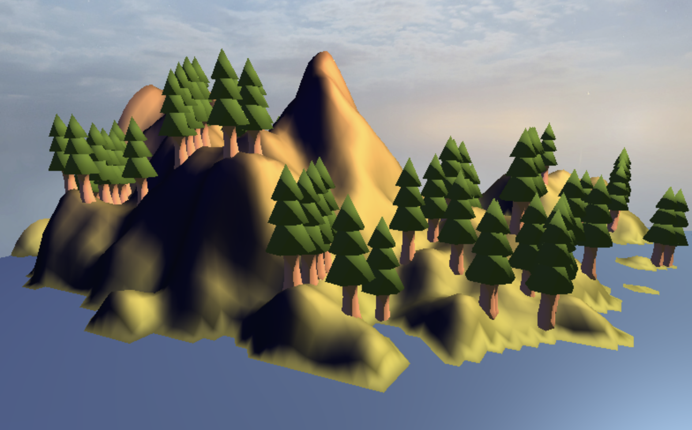

# FireGL -- Fire Simulation in WebGL

<video src="videos/demo_teaser.mp4" height="300px" autoplay loop></video>

<figcaption style="text-align: center;">A short teaser video, gif, or image showing an overview of the final result.</figcaption>

## Abstract

TODO

## Overview

<video src="videos/video-group64.mp4" height="210px" autoplay loop style="vertical-align: middle;"></video>

<figcaption style="text-align: center;">Our final video showing off the major features of our project</figcaption>

TODO

## Feature validation

<table>
	<caption>Feature Summary</caption>
	<thead>
		<tr>
			<th>Feature</th>
			<th>Adapted Points</th>
			<th>Status</th>
		</tr>
	</thead>
	<tbody>
		<tr>
			<td>Mesh and Scene Design</td>
			<td>5</td>
			<td style="background-color: #d4edda;">Completed</td>
		</tr>
		<tr>
			<td>Bloom</td>
			<td>5</td>
			<td style="background-color: #d4edda;">Completed</td>
		</tr>
		<tr>
			<td>Toon Shaders</td>
			<td>10</td>
			<td style="background-color: #d4edda;">Completed</td>
		</tr>
		<tr>
			<td>Deferred Shading</td>
			<td>15</td>
			<td style="background-color: #d4edda;">Completed</td>
		</tr>
		<tr>
			<td>Particle Effects</td>
			<td>15</td>
			<td style="background-color: #d4edda;">Completed</td>
		</tr>
	</tbody>
</table>

### Mesh and Scene Design

#### Implementation

TODO

#### Validation

TODO

### Bloom

#### Implementation

TODO

#### Validation

TODO

### Toon Shaders

#### Implementation

TODO

#### Validation

TODO

### Deferred Shading

#### Implementation

Our deferred shading pipeline uses a standard G-buffer, storing camera-space position, normal, and albedo (material color) vectors, along with a specular intensity scalar, in three color buffers inside the G-buffer. We found storing camera-space vectors to be simpler for our needs than storing world-space vectors like most tutorials recommend. We use a unified vertex shader (`deferred.vert.glsl`) to pass buffer data to all the inputs of the deferred fragment shaders.

We rewrote the lighting shaders (deferred versions only) to use light volumes. Instead of iterating over lights per object, each light is represented as a sphere mesh, and shading is computed per fragment within the light volume using additive blending and front-face culling. We adjusted the non deferred shaders (without changed the original computation) so that we could compare the two more easily.

All lights use the same mesh so in theory we could render them with GPU instancing.

#### Validation

TODO

### Particle Effects

#### Implementation

We began by implementing a basic billboard shader. To support real particle systems, we extended our particle containers to store lists of particles and render the same mesh instance for each one. Initial performance was poor, as the draw logic iterated over each particle on the CPU (JavaScript side). To address this, we implemented GPU instancing, allowing us to upload particle data, such as position offsets, colors, and sizes, in a single draw call per container. This optimization significantly improved rendering performance. We still use the original billboard fragment and vertex shaders for our particles, but we could replace them with alternate shaders, e.g., shaders that render 3D meshes to achieve 3D particles instead. 

We removed the original `billboard_sr.js` file after we were able to fully replicate our 'billboard' with a particle container.

#### Validation

TODO

## Discussion

### Additional Components

- Overlay for skybox for a toggleable night mode
- Natural fire spread
- Manual fire spread (F key)
- 

### Failed Experiments

TODO

### Challenges

TODO

## Contributions

<table>
	<caption>Worked hours</caption>
	<thead>
		<tr>
			<th>Name</th>
			<th>Week 1</th>
			<th>Week 2</th>
			<th>Week 3</th>
			<th>Week 4</th>
			<th>Week 5</th>
			<th>Week 6</th>
			<th>Week 7</th>
			<th>Total</th>
		</tr>
	</thead>
	<tbody>
		<tr>
			<td>Leopold Popper</td>
			<td>1</td>
			<td style="background-color: #f0f0f0;">2</td>
			<td></td>
			<td>10</td>
			<td></td>
			<td></td>
			<td></td>
			<td></td>
		</tr>
		<tr>
			<td>Ali Gorgani</td>
			<td>1</td>
			<td style="background-color: #f0f0f0;">1</td>
			<td></td>
			<td>11</td>
			<td></td>
			<td></td>
			<td></td>
			<td></td>
		</tr>
		<tr>
			<td>Anthony Tamberg</td>
			<td>1</td>
			<td style="background-color: #f0f0f0;">0</td>
			<td></td>
			<td>9</td>
			<td>6</td>
			<td>14</td>
			<td>10</td>
			<td></td>
		</tr>
	</tbody>
</table>

<table>
	<caption>Individual contributions</caption>
	<thead>
		<tr>
			<th>Name</th>
			<th>Contribution</th>
		</tr>
	</thead>
	<tbody>
		<tr>
			<td>Leopold Popper</td>
			<td>1/3</td>
		</tr>
		<tr>
			<td>Ali Gorgani</td>
			<td>1/3</td>
		</tr>
		<tr>
			<td>Anthony Tamberg</td>
			<td>1/3</td>
		</tr>
	</tbody>
</table>

#### Comments

TODO

## References

[Regl API](https://github.com/regl-project/regl/blob/main/API.md)
[Regl GPU Instancing Example](https://github.com/regl-project/regl/blob/b907a63bbb0d5307494657d4028ceca3b4615118/example/instance-mesh.js)
[Regl Deferred Shading Example](https://github.com/regl-project/regl/blob/main/example/deferred_shading.js)
[Deferred Shading Tutorial](https://learnopengl.com/Advanced-Lighting/Deferred-Shading)
[Billboards and Particles Tutorial](https://www.opengl-tutorial.org/intermediate-tutorials/billboards-particles/)
