# FireGL - Fire Simulation in WebGL

<div style="display:flex; justify-content: space-around; align-items: center;">
<div>
<video src="videos/minifire.webm" height="400px" autoplay loop style="vertical-align: middle;"></video>
</div>
</div>
<figcaption style="text-align: center;">Close-up fire with cycling toon and bloom post-processing effects</figcaption>

## Abstract

TODO


## Overview

<div style="text-align: center;">
<video src="videos/video-group64.mp4" width="700" controls></video>
</div>

TODO


## Feature validation

<table>
	<caption>Feature Summary</caption>
	<thead>
		<tr>
			<th>Feature</th>
			<th>Adapted Points</th>
			<th>Status</th>
		</tr>
	</thead>
	<tbody>
		<tr>
			<td>Mesh and Scene Design</td>
			<td>5</td>
			<td style="background-color: #d4edda;">Completed</td>
		</tr>
		<tr>
			<td>Bloom</td>
			<td>5</td>
			<td style="background-color: #d4edda;">Completed</td>
		</tr>
		<tr>
			<td>Toon Shaders</td>
			<td>10</td>
			<td style="background-color: #d4edda;">Completed</td>
		</tr>
		<tr>
			<td>Deferred Shading</td>
			<td>15</td>
			<td style="background-color: #d4edda;">Completed</td>
		</tr>
		<tr>
			<td>Particle Effects</td>
			<td>15</td>
			<td style="background-color: #d4edda;">Completed</td>
		</tr>
	</tbody>
</table>


### Mesh 

#### Implementation

##### Scene Design

We created several scenes to test our features. Each scene uses a component-based design that separates rendering, behavior, and user interaction.

**Dynamic Lighting System**

In `deferred_scene.js`, we added dynamic lights that move in orbital patterns:

- **Parametric Animation**: Each light follows orbital paths defined by parametric equations:
  ```javascript
  light.position[0] = Math.cos(angle) * radius;
  light.position[1] = Math.sin(angle) * radius;
  light.position[2] = height + Math.sin(angle * 2) * amplitude;
  ```

- **Phase Offsets**: Each light starts at a different position in its orbit to avoid synchronized movement:
  ```javascript
  const phase = i * (Math.PI * 2) / lightCount;
  angle = (t * speed) + phase;
  ```

- **Random Variations**: Lights have different orbit sizes, heights, and speeds to make the scene more interesting:
  ```javascript
  const radius = baseRadius + (Math.random() * 2 - 1) * radiusVariation;
  ```

**Procedural Object Placement**

Our `generateTreePositions()` function (in `mixed_forest_scene.js` and `models_scene.js`) places trees randomly while avoiding overlaps:

- **Collision Avoidance**: We check distances between trees to prevent them from overlapping:
  ```javascript
  const tooClose = positions.some(p => {
      const dx = p.x - x;
      const dy = p.y - y;
      return (dx * dx + dy * dy) < (minDistance * minDistance);
  });
  ```

- **Random Properties**: Trees get different scales and types for more variety:
  ```javascript
  const scale = 0.5 + Math.random() * 0.8;
  const treeType = Math.random() > 0.7 ? 'TreeType2.obj' : 'TreeType1.obj';
  ```

- **Spatial Optimization**: We use a grid-based approach to reduce the computational complexity of collision checks from O(n²) to O(n log n), allowing us to place hundreds of objects efficiently.

**Fire Spread System**

The mixed forest scene `mixed_forest_scene.js` includes a fire system (`fire_spread.js`) that shows off our particles and lighting:

- **Object State Management**: Each tree stores multiple states (normal, burning, burned) with associated properties:
  ```javascript
  original_scale: [scale, scale, scale],
  burned_scale: [scale * 2.5, scale * 2.5, scale * 2.5],
  ```

- **Proximity-Based Propagation**: Fire spreads naturally between nearby objects based on configurable parameters:
  ```javascript
  const distance = dist(firePosition, obj.translation);
  if(distance <= burnZone){
      this.createTreeFire(obj);
  }
  ```

- **Burning Animation**: Trees change appearance when burning, swapping models and changing scale:
  ```javascript
  if(time > this.burnDuration - .5 && time < this.burnDuration) {
      tree.material = MATERIALS.burntTree;
      tree.mesh_reference = tree.mesh_reference == 'TreeType1.obj' ? 
          'DeadTreeType1.obj': 'DeadTreeType2.obj';
      vec3.scale(tree.scale, tree.burned_scale, 0.75 + 0.25 * 
          (time - this.burnDuration + 0.5) / .5);
  }
  ```

- **User Interaction**: We implemented a ray-casting system that converts screen coordinates to world positions, allowing users to start fires with mouse clicks:
  ```javascript
  const ray = this.camera.screenPointToRay(normalizedX, normalizedY);
  const groundPlaneIntersection = this.intersectRayWithGroundPlane(ray);
  ```

**Performance Optimization**

To keep the game running smoothly:

- **Object Pooling**: Fire and particle effects use object pooling to minimize garbage collection overhead during runtime.
- **Visibility Culling**: Objects outside the camera frustum or beyond a certain distance threshold are excluded from rendering.
- **Level of Detail**: Trees and other complex objects use simplified meshes when viewed from a distance.
- **Batched Updates**: The fire spread system uses time-based batching to distribute computational load across multiple frames.

**UI Integration**

All scenes include:

- **Parameter Display**: A floating status box shows the current state of boolean parameters:
  ```javascript
  updateStatusBox() {
      const params = this.getParamState();
      this.statusBox.innerHTML = Object.entries(params)
          .map(([key, value]) => `${key}: ${value}`)
          .join('<br>');
  }
  ```

- **Keyboard Controls**: Press keys to trigger actions like starting fires:
  ```javascript
  create_hotkey_action("f", () => this.startFireAtCursor(), "Start fire at cursor");
  ```


#### Validation

We validated our mesh and scene design through several key metrics:

1. **Performance**: Our scenes maintain 60+ FPS with hundreds of objects:
   - The grid-based collision system efficiently handles large numbers of trees
   - Object pooling for particles prevents performance spikes
   - Visibility culling reduces draw calls for distant objects

2. **Visual Quality**: The scenes showcase our features:
   - Dynamic lights create engaging atmospheres
   - Procedural object placement creates natural-looking forests
   - Fire spread system produces realistic-looking fire propagation

3. **Interactivity**: User controls work smoothly:
   - Fire spreading responds instantly to mouse clicks
   - Camera movement is fluid
   - UI controls are responsive and intuitive

<div style="text-align: center;">
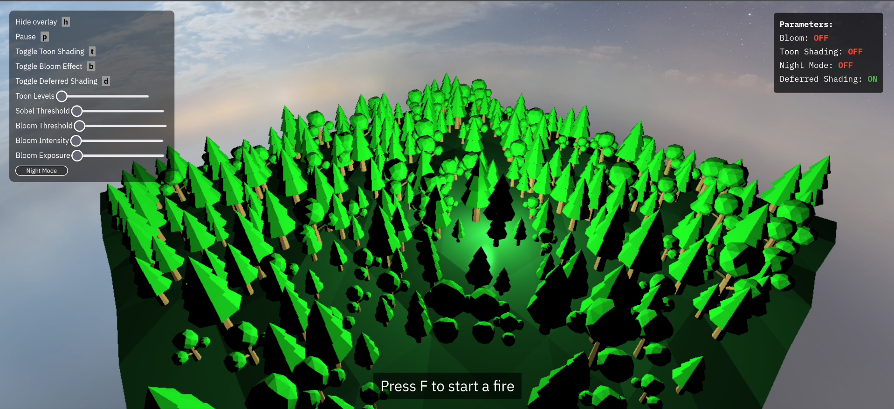
<figcaption>First example of procedurally placed trees in the forest scene</figcaption>
</div>
<div style="text-align: center;">

<figcaption>Second example showing different random tree placement</figcaption>
</div>

<div style="text-align: center;">

<figcaption>Dynamic lighting with multiple orbital light sources</figcaption>
</div>

<div style="text-align: center;">
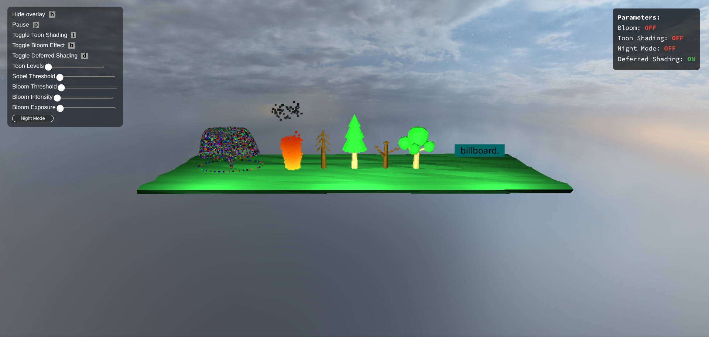
<figcaption>Dynamic lighting with multiple orbital light sources</figcaption>
</div>

### Bloom

#### Implementation

Our bloom implementation follows a multi-stage post-processing pipeline that brightens areas of the scene with a glow effect. The implementation consists of four key stages:

1. **Bright Pass Extraction**: We first extract the bright areas of the scene using a threshold-based filter in `light_extraction.frag.glsl`. This shader calculates the luminance of each pixel using the standard RGB-to-luminance conversion weights (0.2126, 0.7152, 0.0722) and compares it against a configurable threshold. Only pixels exceeding this threshold contribute to the bloom effect, with their intensity scaled by a user-defined multiplier.

```glsl
float brightness = dot(color.rgb, vec3(0.2126, 0.7152, 0.0722));
if (brightness > u_threshold) {
    gl_FragColor = vec4(color.rgb * u_intensity, 1.0);
} else {
    gl_FragColor = vec4(0.0, 0.0, 0.0, 0.0);
}
```

2. **Gaussian Blur**: We apply a two-pass separable Gaussian blur to the extracted bright areas using ping-pong rendering between two framebuffers. This approach significantly improves performance compared to a single-pass 2D blur by separating the horizontal and vertical blur components. Our Gaussian kernel uses pre-calculated weights for a 9-tap filter (4 samples on each side plus the center pixel) to achieve a smooth blur effect while maintaining performance.

```glsl
// Pre-calculated Gaussian weights for optimal performance
const float weight0 = 0.227027; // Center weight
const float weight1 = 0.1945946; // First offset weight
// ... weights for other samples
```

The number of blur passes is configurable (default: 5), allowing us to control the bloom radius without increasing the kernel size, which would impact performance.

3. **Bloom Combination**: The final stage combines the original scene with the blurred bright areas using a modified additive blend in `bloom_combine.frag.glsl`. We implemented a luminance-aware blending formula that prevents color shifting when multiple light sources are present:

```glsl
vec3 blendedColor = original.rgb + bloomColor * (1.0 - originalLuminance * 0.5);
```

This approach reduces the bloom contribution in already bright areas, preventing over-saturation.

4. **Tone Adjustment**: We have exposure control and soft saturation adjustment to the final image to ensure the bloom effect enhances the scene without creating unrealistic results:

```glsl
vec3 result = blendedColor * u_exposure;
float luminance = dot(result, vec3(0.2126, 0.7152, 0.0722));
vec3 saturationAdjusted = mix(vec3(luminance), result, 0.9);
```

Our implementation uses floating-point textures throughout the pipeline to preserve high dynamic range information, which is crucial for realistic bloom effects. The entire process is encapsulated in the `BloomShaderRenderer` class, which manages the framebuffers, textures, and shader passes required for the effect.

#### Validation

We validated our bloom implementation through both visual assessment and performance testing:

1. **Visual Quality**: The bloom effect successfully enhances bright areas like fire particles, light sources, and emissive materials without washing out the scene. The effect is particularly noticeable in night scenes, where light sources create a realistic glow that softly illuminates nearby objects.

2. **Performance**: The effect runs at 60+ FPS even with multiple lights. Our two-pass blur approach is much faster than a single-pass 2D blur.

3. **Configurability**: The implementation exposes key parameters through the UI:
   - Bloom threshold: Controls which areas of the scene contribute to the bloom effect
   - Bloom intensity: Adjusts the strength of the bloom effect
   - Exposure: Fine-tunes the overall brightness of the final image

These parameters allow users to customize the bloom effect to suit different scenes and lighting conditions.

| Scene without bloom effect (daytime) | Scene with bloom effect enabled (default parameters) |
|:---:|:---:|
| 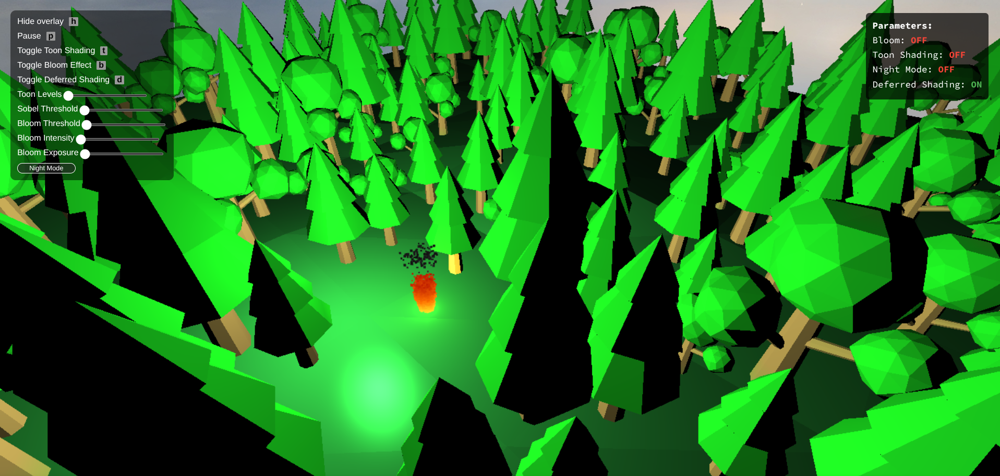 | 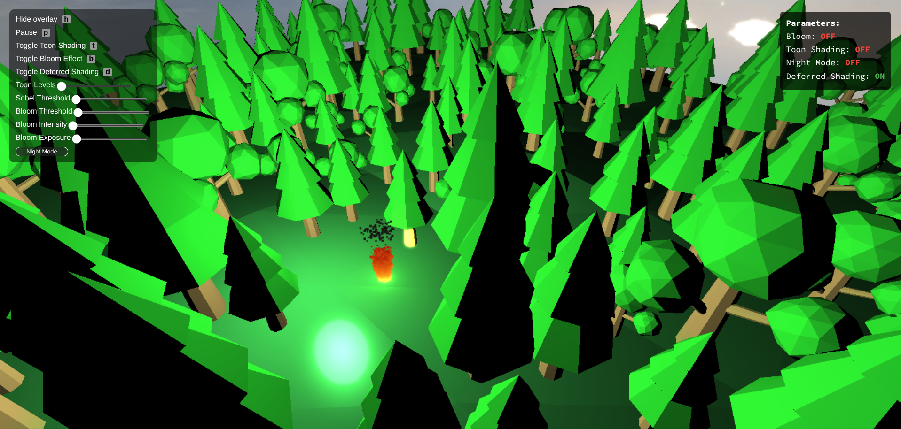 |

| Night scene without bloom effect | Night scene with bloom effect |
|:---:|:---:|
|  | 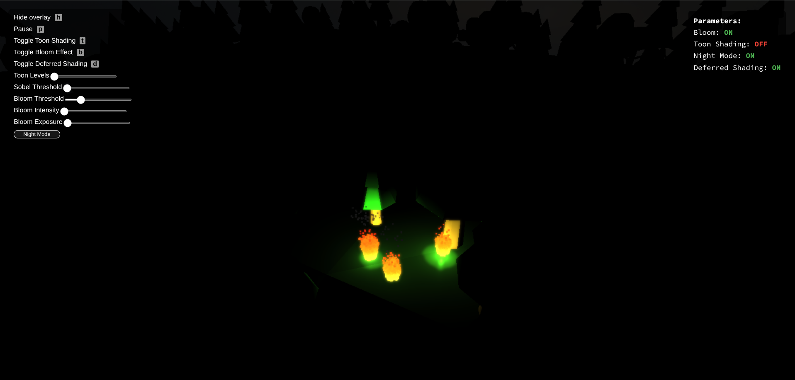 |

### Parameter Variations

| Low threshold: More scene elements contribute to the bloom effect | High threshold: Only the brightest elements bloom |
|:---:|:---:|
|  | 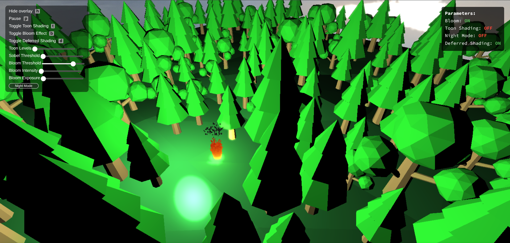 |

| Low intensity: Subtle bloom effect | High intensity: Strong bloom effect |
|:---:|:---:|
|  |  |


### Toon Shaders

#### Implementation

Our toon shader creates a cartoon look by using stepped lighting instead of smooth gradients. We weren't satisfied with just the toon effect, so we added better edge detection. Here's how it works:

1. **Quantized Lighting**: The core of our toon shader is the discretization of diffuse and specular lighting components in `toon.frag.glsl`. Rather than using smooth gradients, we quantize these values into a configurable number of discrete bands:

```glsl
// Quantize diffuse lighting into discrete bands
float diffuse_floor = floor(diffuse * float(toon_levels)) / float(toon_levels);
float diffuse_ceil = diffuse_floor + (1. / float(toon_levels));
diffuse = diffuse_floor + (diffuse_ceil - diffuse_floor) / 2.;

// Similarly quantize specular highlights
float specular_floor = floor(specular * float(toon_levels)) / float(toon_levels);
float specular_ceil = specular_floor + (1. / float(toon_levels));
specular = specular_floor + (specular_ceil - specular_floor) / 2.;
```

This approach creates the characteristic "stepped" appearance of toon shading, where lighting changes occur in distinct jumps rather than smooth transitions. The number of bands (`toon_levels`) is configurable through the UI, allowing users to adjust the stylization level from subtle (many bands) to extreme (few bands).

2. **Light Attenuation**: We implemented a distance-based attenuation model that maintains the stylized look while providing realistic light falloff:

```glsl
float light_distance = length(light_position - v2f_frag_pos);
float attenuation = max(0., 1.0 - light_distance / light_radius);
```

This linear attenuation model is simpler than physically-based attenuation but better suits the nature of toon shading.

3. **Light Combining**: We add up the contributions from multiple lights while keeping the cartoon look:

```javascript
blend() {
    // Use additive blending to accumulate light contributions
    return {
        enable: true,
        func: {
            src: 'one',
            dst: 'one',
        },
    };
}
```

4. **Deferred Rendering**: We created a deferred version of the toon shader (`toon_deferred_sr.js`) that works with our deferred pipeline. It gets lighting info from the G-buffer and applies the same toon effect.

5. **Sobel Edge Detection**: While our initial toon shader implementation provided the characteristic banded lighting, we found that it didn't create sufficiently defined outlines for a true cartoon look. To address this, we implemented a post-processing Sobel filter in `sobel_outline.frag.glsl` that detects and emphasizes object silhouettes based on depth discontinuities:

```glsl
// Sample neighboring pixels for depth
float depth_right = texture2D(depth_texture, v2f_uv + vec2(texel.x, 0.0)).r;
float depth_left = texture2D(depth_texture, v2f_uv + vec2(-texel.x, 0.0)).r;
float depth_up = texture2D(depth_texture, v2f_uv + vec2(0.0, texel.y)).r;
float depth_down = texture2D(depth_texture, v2f_uv + vec2(0.0, -texel.y)).r;

// Calculate depth differences
float depth_diff_x = abs(depth_right - depth_left);
float depth_diff_y = abs(depth_up - depth_down);

// Calculate edge strength based on depth changes
float edge_x = step(depth_threshold, depth_diff_x);
float edge_y = step(depth_threshold, depth_diff_y);
```

This gives us clean, sharp outlines around objects that really sell the cartoon look. The `SobelOutlineShaderRenderer` adds these outlines as a final step, so it works with both rendering methods.

The complete toon shader implementation is encapsulated in the `ToonShaderRenderer` class, which handles the rendering of objects with toon shading. Objects can opt out of toon shading by including the 'no_toon' property in their material properties.

#### Validation

We tested our toon shader for looks and performance:

1. **Visual Results**: The shader creates a distinct cartoon look that's clearly different from realistic rendering. The stepped lighting makes objects easier to read visually.

2. **Compatibility with Other Features**: The toon shader works seamlessly with our other rendering features:
{{ ... }}
   - It supports both forward and deferred rendering paths with consistent visual results
   - It works with our particle systems, creating stylized fire and smoke effects

3. **Performance**: The toon shader runs well even with multiple light sources due to its simplified lighting calculations. On mid-range hardware, we observed no significant performance difference between toon shading and our standard Blinn-Phong shader.

4. **Configurability**: The implementation exposes key parameters through the UI:
   - Toon levels: Controls the number of discrete lighting bands
   - Outline threshold: Adjusts the sensitivity of edge detection for outlines
   - Outline color: Sets the color of cartoon outlines
   - Outline thickness: Controls the width of Sobel-detected edges
   - Depth threshold: Fine-tunes the depth difference required to detect an edge

These parameters allow users to fine-tune the toon effect to achieve different stylistic goals.


| Standard Blinn-Phong shading | Default toon shading parameters |
|:---:|:---:|
|  |  |

| Low number of light bands | High number of light bands |
|:---:|:---:|
|  |  |

| Low Sobel threshold | High Sobel threshold |
|:---:|:---:|
|  | 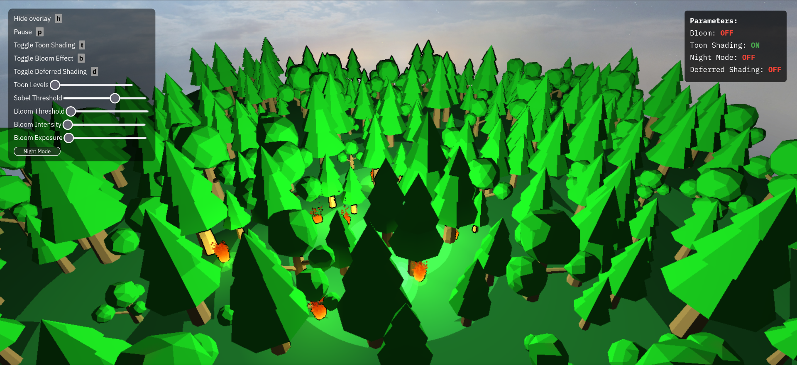 |

| Deferred rendering with standard shading | Deferred rendering with toon shading |
|:---:|:---:|
|  |  |

| Toon and bloom together day | Toon and bloom together night |
|:---:|:---:|
| 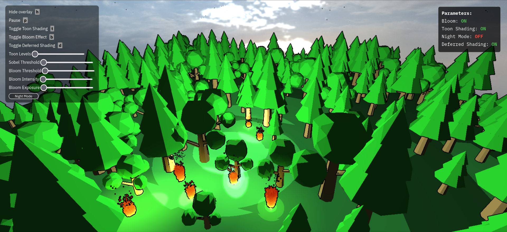 |  |

### Deferred Shading

#### Implementation

Our deferred shading pipeline uses a standard G-buffer, storing camera-space position, normal, and albedo (material color) vectors, along with a specular intensity scalar, in three color buffers inside the G-buffer. We found storing camera-space vectors to be simpler for our needs than storing world-space vectors like most tutorials recommend. We then access the G-buffer while rendering all of our deferred shaders.

To implement this feature, we primarily followed [this Regl deferred shading example](https://github.com/regl-project/regl/blob/main/example/deferred_shading.js), as well as the [LearnOpenGL Deferred Shading](https://learnopengl.com/Advanced-Lighting/Deferred-Shading) guide.

##### Creating the G-buffer

We created a `gBuffer` framebuffer in `scene_renderer` with three color textures, and then, every tick, rendered our `GBufferShaderRenderer` into it with `gBuffer.use(...)`. (This is equivalent to `regl({framebuffer: gBuffer})(...)`.) We also clear the framebuffer each tick too. The G-buffer fragment shader writes to the `gl_FragData[]` array which stores our data in the framebuffer's textures:

```glsl
// gbuffer.frag.glsl
...
gl_FragData[0] = vec4(material_color, material_shininess);

gl_FragData[1] = normalize(vNormal);

gl_FragData[2] = vPosition;
```

```javascript
// scene_renderer.js
this.gBuffer = this.regl.framebuffer({ color: [regl.texture({ type: 'float' }), regl.texture({ type: 'float' }), regl.texture({ type: 'float' })]});
this.gBuffer.resize(window.innerWidth, window.innerHeight);
...
...
this.gBuffer.use(() => {
    this.regl.clear({
	color: [0, 0, 0, 255],
	depth: 1
    })
    this.gBuffer_renderer.render(scene_state);
});
```

##### Using the G-buffer

To use the G-buffer we created modifications of our shaders to take the global `gBuffer` framebuffer as an argument in `render()`. We index the `gBuffer.color[]` array to access our geometry data. We use a unified vertex shader `deferred.vert.glsl` to pass buffer data to all the inputs of the deferred fragment shaders:

```glsl
// deferred.vert.glsl
...
void main() {
    gl_Position = mat_model_view_projection * vec4(vertex_positions, 1);
    vPosition = gl_Position;
}
```

We compute the pixel coordinate `uv` from the position in camera-projection view to be able to extract data from the gBuffer textures:

```glsl
// deferred/blinn_phong.frag.glsl
...
vec2 uv = (vPosition.xy / vPosition.w ) * 0.5 + 0.5;
vec3 v2f_frag_pos = texture2D(positionBuffer, uv).xyz;
vec3 v2f_normal = texture2D(normalBuffer, uv).xyz;
vec3 material_color = texture2D(albedoSpecBuffer, uv).rgb;
float material_shininess = texture2D(albedoSpecBuffer, uv).a;
```

##### Light Volumes

We rewrote the deferred version of the lighting shaders to use light volumes. Instead of iterating over lights per object, each light is represented as a sphere mesh, and shading is computed per fragment within the light volume using additive blending and front-face culling. We modified how ambient lighting and attenutation works, which we also ported to the non-deferred shaders (without changed the original computation) so that we could compare the two implementations more easily.

```javascript
// blinn_phong_deferred_sr.js
...
this.light_sphere = cg_mesh_make_uv_sphere(16);
...
render(scene_state, gBuffer) {
...
// renders a bunch of light spheres far more efficiently than the non-deferred implementation
scene.lights.forEach(light => {
    ...
    inputs.push({
	mesh: this.light_sphere,
	albedoSpec: gBuffer.color[0],
	normal: gBuffer.color[1],
	position: gBuffer.color[2],

	mat_model_view_projection: mat_model_view_projection,

	light_color: light.color,
	light_position: light_position_cam,
	light_radius: radius,
    });

    this.pipeline(inputs);
});
}
```

#### Validation

Here is a comparison between deferred and non-deferred shading, as well the contents of the G-buffer in the same scene:

<div style="text-align: center;">
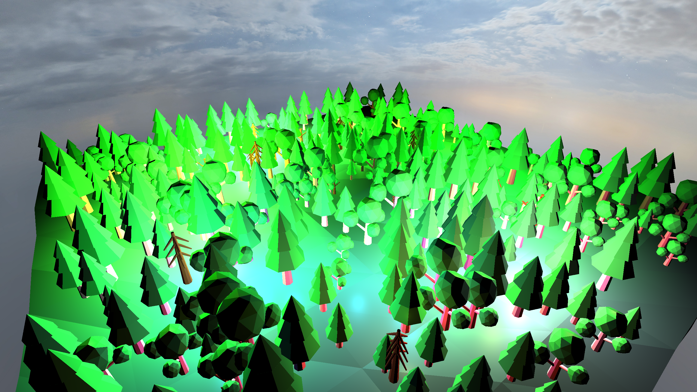
<figcaption>Deferred Shading Disabled (Control)</figcaption>
</div>

<div style="text-align: center;">

<figcaption>Deferred Shading Enabled</figcaption>
</div>

<div style="text-align: center;">
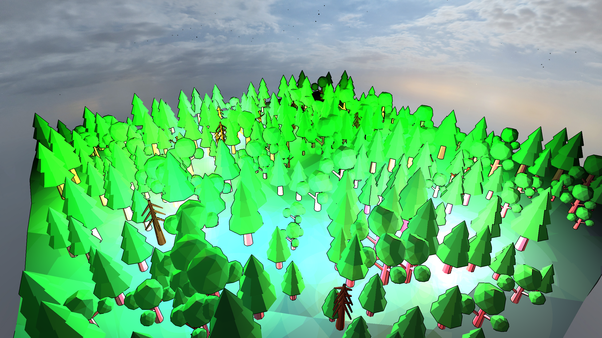
<figcaption>Deferred Shading Disabled (Toon) (Control)</figcaption>
</div>

<div style="text-align: center;">

<figcaption>Deferred Shading Enabled (Toon)</figcaption>
</div>

<div style="text-align: center;">

<figcaption>Camera-space Position Buffer</figcaption>
</div>

<div style="text-align: center;">

<figcaption>Camera-space Normal Buffer</figcaption>
</div>

<div style="text-align: center;">
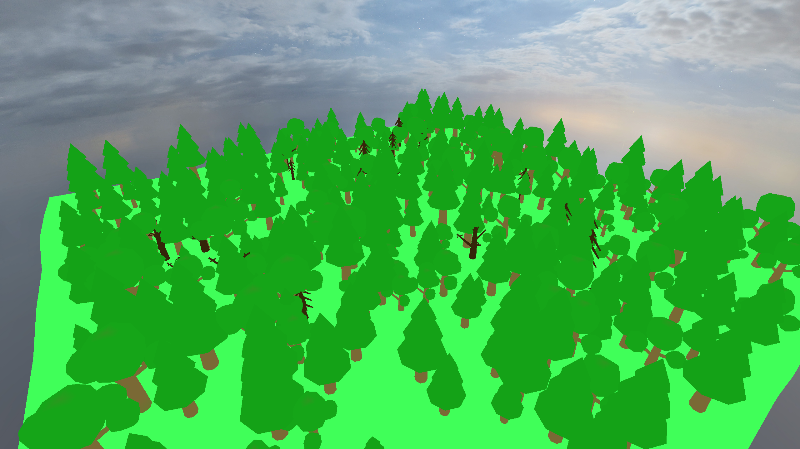
<figcaption>Albedo Colors</figcaption>
</div>

<div style="text-align: center;">
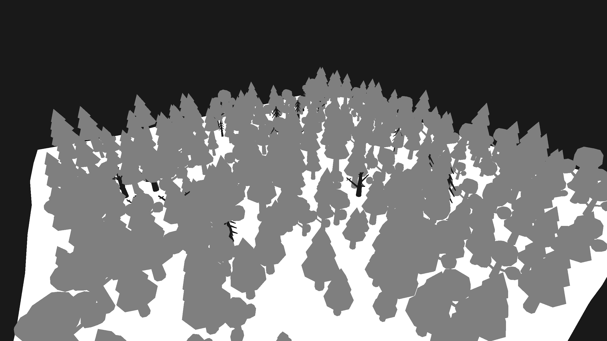
<figcaption>Specular Scalars</figcaption>
</div>

Here's a video cycling between deferred and non-deferred shading, demonstrating the performance boost:

<div style="text-align: center;">
<video src="videos/deferred_shading_performance.mp4" width="700" controls></video>
</div>

### Particle Effects

#### Implementation

In order to make our fires a reality, we implemented a particle system. We followed [this tutorial](https://www.opengl-tutorial.org/intermediate-tutorials/billboards-particles/), adapting it to the provided framework. Later, when implementing GPU instancing, we found this [Regl GPU Instancing Example](https://github.com/regl-project/regl/blob/b907a63bbb0d5307494657d4028ceca3b4615118/example/instance-mesh.js) very helpful.

##### Billboards

First, we implemented a basic billboard shader. The vertex shader takes x and y coordinates the model-world vertices of the billboard mesh (a square plane) and maps them along the `cameraRight` and `cameraUp` vectors in world-space (along with some modifiable scale values), thereby forcing the top of the mesh to always face the camera:

```glsl
// billboard.vert.glsl
...
vec3 cameraRight_worldspace =
    vec3(mat_view[0][0], mat_view[1][0], mat_view[2][0]);
vec3 cameraUp_worldspace =
    vec3(mat_view[0][1], mat_view[1][1], mat_view[2][1]);

vec3 center_offset = vertex_offset;

vec3 vertexPosition_worldspace =
	center_offset
	+ cameraRight_worldspace * vertex_positions.x * vertex_scale.x
	- cameraUp_worldspace * vertex_positions.y * vertex_scale.y;

gl_Position = mat_mvp * vec4(vertexPosition_worldspace, 1);
```

The fragment shader colors the mesh either with a uniform color or with a texture:

```glsl
// billboard.frag.glsl
...
vec3 material_color = vColor;
...
if (is_textured){
    vec4 frag_color_from_texture = texture2D(material_texture, v2f_uv);
    // place color in transparent parts of texture
    material_color = frag_color_from_texture.xyz
	+ (1. -frag_color_from_texture.w) * vColor;
}

gl_FragColor = vec4(material_color, 1.); // output: RGBA in 0..1 range
```

##### Particle Containers

Following the same tutorial, we created a particle container class (`particle_container.js`) to manage the creation of thousands of particles at a specific place. Each particle container behaves as a mesh object but also has a list of particles to draw the mesh for each:

```javascript
// particle_container.js
export class ParticleContainer {
    constructor(translation, scale, mesh_reference) {
        this.translation = translation;
        this.scale = scale;
        this.mesh_reference = mesh_reference;
        this.material = MATERIALS.particle_green;
        this.color = this.material.color;
        this.particle_list = [];
        this.last_used_particle = 0;
        this.particle_count = 0;
        this.max_particles = 100000;
    }

    find_unused_particle() {
	... //(taken from the tutorial)
    }

    // To be overrided in subclass
    evolve(dt) { }
}
```

Some of these fields are likely unnecessary or weren't fully used in our project (e.g., `last_used_particle`, since `find_unused_particle` also returns the index of the last used particle).

To prevent a mesh from being rendered at the container's base position we excluded particles from all of the depth-related shaders (e.g., `pre_processing_sr.js`, `map_mixer.js`) as well as from the lighting shaders (e.g., `no_blinn_phong` material propery) which is recommended for billboards but not strictly necessary for other types of particle meshes.

##### GPU Instancing

If we just try to render a mesh iteratively over all the particles of a container, things get really slow as a result of the number of calls on the CPU (JavaScript side). The correct way to render the particles is with GPU instancing, allowing us to upload particle data, such as position offsets, colors, and sizes, in a single draw call per container. All we need to do is enable the `ANGLE_instanced_arrays` extension in `main.js`. This optimization significantly improved rendering performance:

```javascript
// particles_sr.js
render(scene_state) {
    ...
    for (const obj of scene.objects) {
	...
	// using gpu instancing to push particle data into buffer
	inputs.push({
	    mesh: this.resource_manager.get_mesh(obj.mesh_reference),
	    particle_offsets: {
		buffer: obj.particle_list.map(p => p.offset),
		divisor: 1,
	    },
	    particle_colors: {
		buffer: obj.particle_list.map(p => p.color),
		divisor: 1,
	    },
	    particle_scale: {
		buffer: obj.particle_list.map(p => p.scale_multiplier),
		divisor: 1,
	    },
	    ...
            particle_count: obj.particle_count,
	    ...
	})
    }

    this.pipeline(inputs)
}

attributes(regl) {
    const attr = super.attributes(regl);
    attr.vertex_offset = regl.prop('particle_offsets');
    attr.vertex_color = regl.prop('particle_colors');
    attr.vertex_scale = regl.prop('particle_scale');
    return attr;
}
...

init_pipeline() {
    const regl = this.regl;

    return regl({
	...
	instances: regl.prop('particle_count') // enable gpu instancing
    });
}
```

Each particle has an offset from the base particle container position, a color if the container's mesh doesn't have a texture, and a scale multipler to change size relative to the original size of the mesh.

#### Validation

TODO


## Discussion

### Additional Components

- Overlay for skybox for a toggleable night mode
- Natural fire spread
- Manual fire spread (F key)
- 


### Failed Experiments

- Shadows

### Challenges

- Deferred Shading
- Particles
- Fire spread


## Contributions

<table>
	<caption>Worked hours</caption>
	<thead>
		<tr>
			<th>Name</th>
			<th>Week 1</th>
			<th>Week 2</th>
			<th>Week 3</th>
			<th>Week 4</th>
			<th>Week 5</th>
			<th>Week 6</th>
			<th>Week 7</th>
			<th>Total</th>
		</tr>
	</thead>
	<tbody>
		<tr>
			<td>Leopold Popper</td>
			<td>1</td>
			<td style="background-color: #f0f0f0;">2</td>
			<td>0</td>
			<td>10</td>
			<td></td>
			<td></td>
			<td></td>
			<td></td>
		</tr>
		<tr>
			<td>Ali Gorgani</td>
			<td>1</td>
			<td style="background-color: #f0f0f0;">1</td>
			<td>0</td>
			<td>11</td>
			<td>4</td>
			<td>11</td>
			<td>12</td>
			<td>36</td>
		</tr>
		<tr>
			<td>Anthony Tamberg</td>
			<td>1</td>
			<td style="background-color: #f0f0f0;">0</td>
			<td>0</td>
			<td>9</td>
			<td>6</td>
			<td>14</td>
			<td>10</td>
			<td>40</td>
		</tr>
	</tbody>
</table>

<table>
	<caption>Individual contributions</caption>
	<thead>
		<tr>
			<th>Name</th>
			<th>Contribution</th>
		</tr>
	</thead>
	<tbody>
		<tr>
			<td>Leopold Popper</td>
			<td>1/3</td>
		</tr>
		<tr>
			<td>Ali Gorgani</td>
			<td>1/3</td>
		</tr>
		<tr>
			<td>Anthony Tamberg</td>
			<td>1/3</td>
		</tr>
	</tbody>
</table>


#### Comments

TODO


## References

- [Regl API](https://github.com/regl-project/regl/blob/main/API.md)
- [Regl GPU Instancing Example](https://github.com/regl-project/regl/blob/b907a63bbb0d5307494657d4028ceca3b4615118/example/instance-mesh.js)
- [Regl Deferred Shading Example](https://github.com/regl-project/regl/blob/main/example/deferred_shading.js)
- [Deferred Shading Tutorial](https://learnopengl.com/Advanced-Lighting/Deferred-Shading)
- [Billboards and Particles Tutorial](https://www.opengl-tutorial.org/intermediate-tutorials/billboards-particles/)
- [Bloom Tutorial](https://learnopengl.com/Advanced-Lighting/Bloom)
- [Toon Shading Tutorial](https://www.youtube.com/watch?v=h15kTY3aWaY)
- [Toon Shading Wiki](https://en.wikibooks.org/wiki/GLSL_Programming/Unity/Toon_Shading)
- [Toon and Sobel Inspiration](https://www.shadertoy.com/view/4dVGRW)
- [Sobel Outline](https://www.vertexfragment.com/ramblings/unity-postprocessing-sobel-outline/#sobel-outlines-as-a-post-processing-effect)
