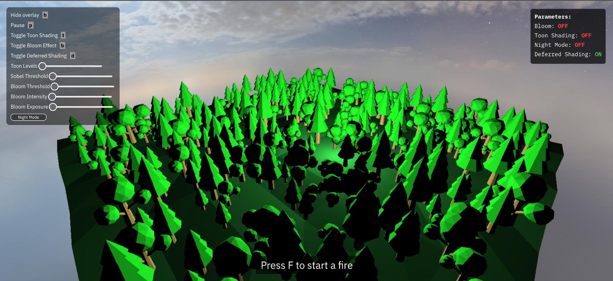
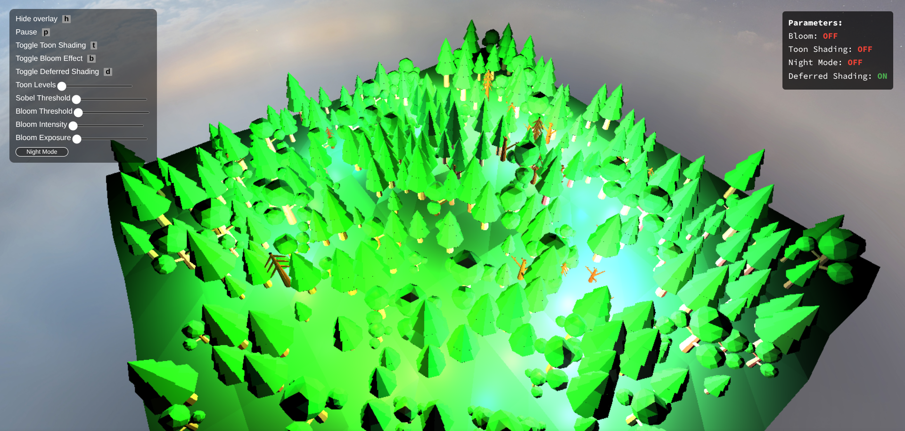
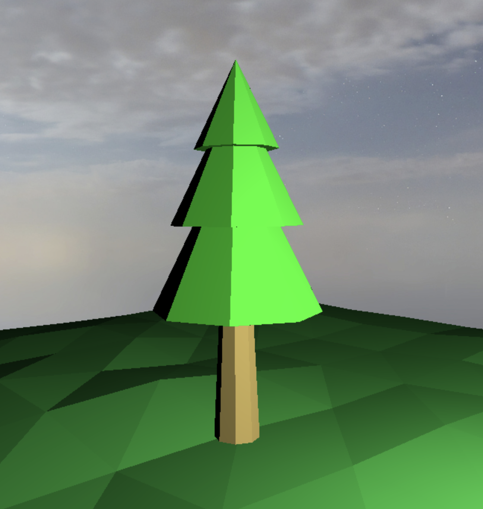
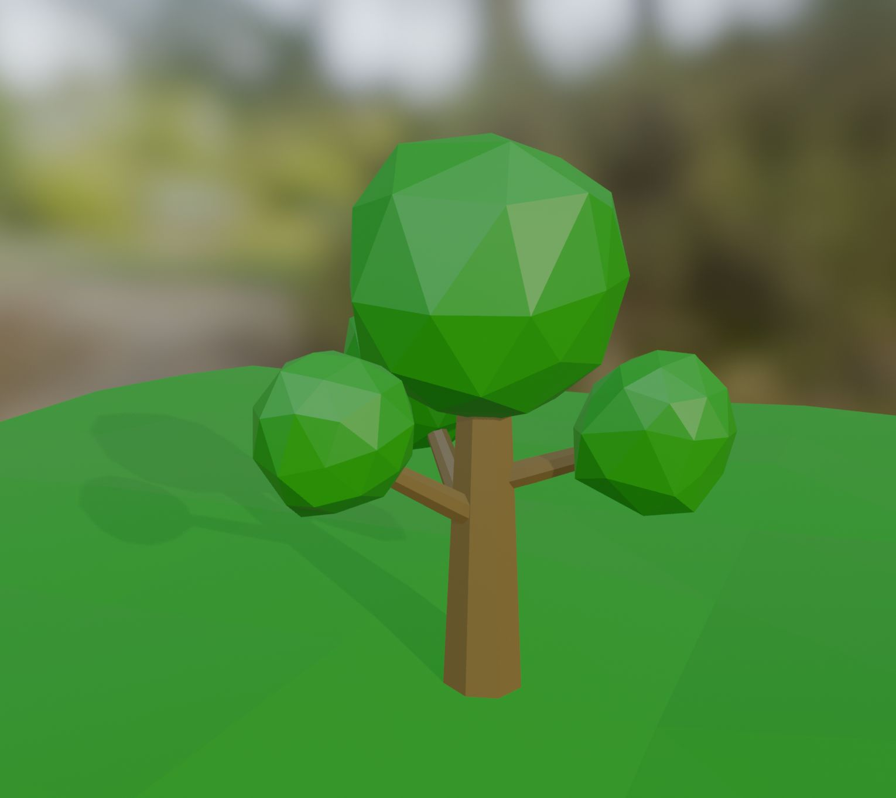
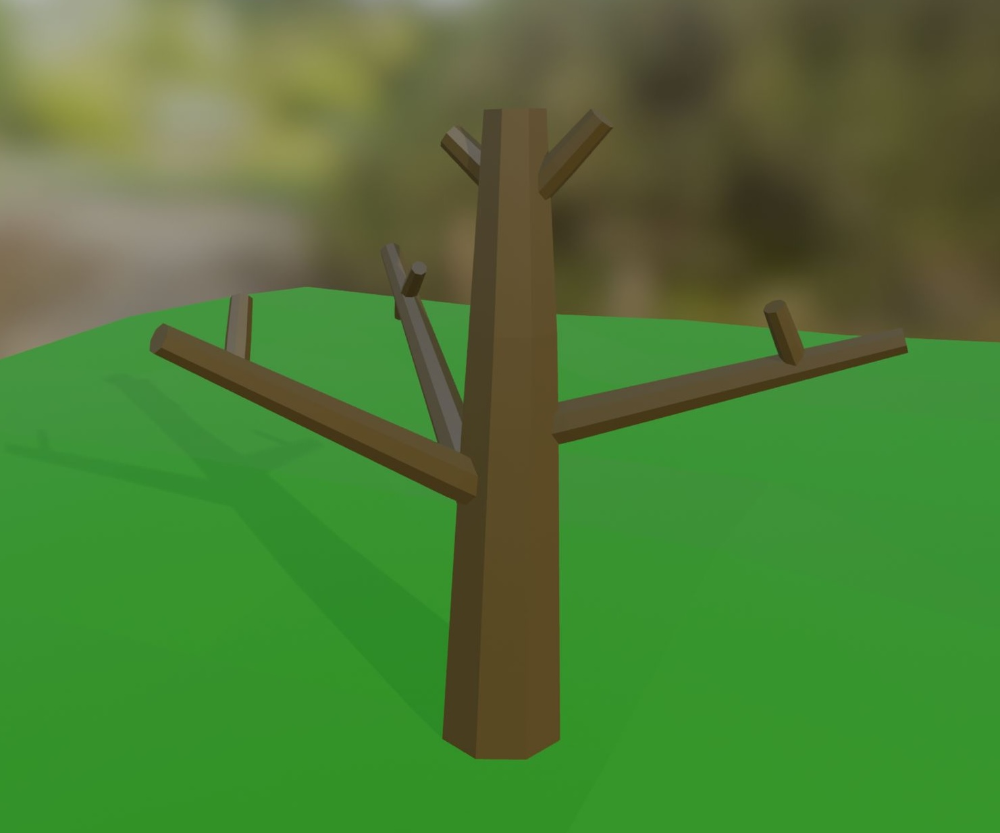
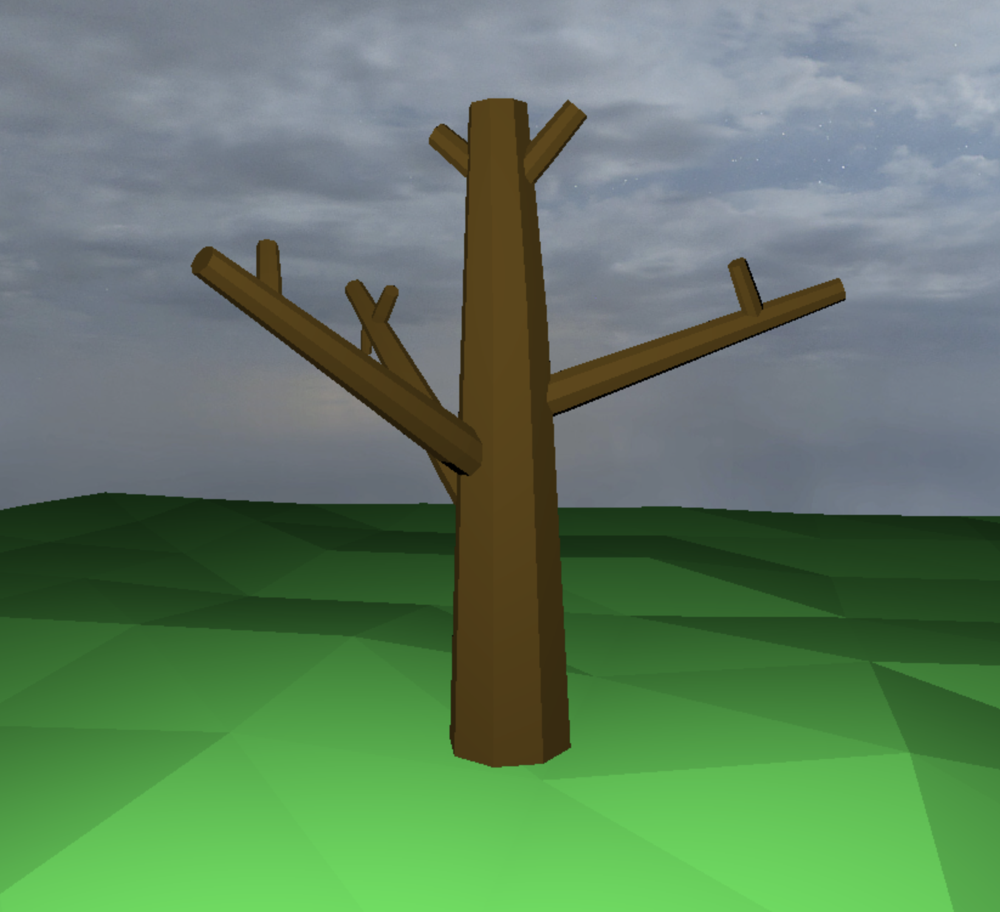
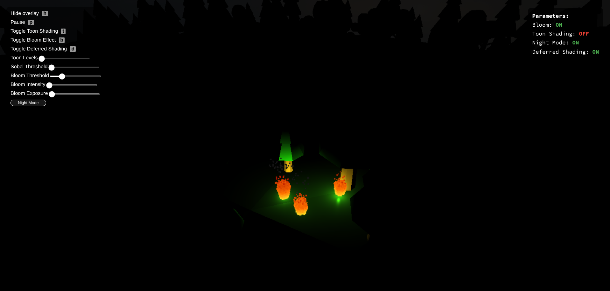
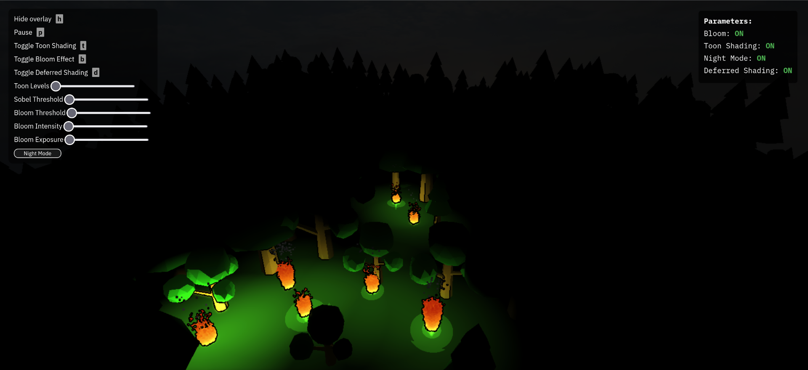

# FireGL - Fire Simulation in WebGL

## Abstract

This project simulates dynamic, stylized fire in a 3D forest scene using WebGL. It combines deferred shading, toon lighting, and bloom post-processing to produce visually distinct effects while maintaining performance. Procedural scene generation and fire propagation systems allow trees to ignite and spread fire based on proximity and time, with visual transitions between normal, burning, and burned states. A GPU-instanced particle system efficiently renders thousands of animated fire and smoke particles efficiently. Users can interact with the simulation by triggering fires. We validate our results through side-by-side visual comparisons and limited performance tests.

## Overview

We set out to create a stylized interactive forest fire simulation. Rather than focusing on physical realism, we aimed to model the essence of fire, with glowing particles, exaggerated lighting effects, and cartoon-inspired shading. The core idea was to use deferred shading to efficiently handle hundreds of dynamic light sources, particles to simulate fire behavior, bloom to create a glowing effect, and toon shading for visual flair, all running on custom-designed scenes.

Scenes are populated with procedurally placed trees of varying types, scales, and positions to create dense, organic-looking forests. Users can initiate fires by pressing a key, triggering a system that spreads flames from tree to tree based on distance and timing. Each tree transitions through multiple states: normal, burning, and burned. These transitions are accompanied by a mesh swap, cartoony animation, and color shifts.

To model the fire itself, we implemented a custom particle system with support for GPU instancing, allowing thousands of particles to be animated each frame with minimal CPU overhead. These particles change size, velocity, and color over their lifetimes, transitioning smoothly between fire and smoke. Combined with bloom post-processing, bright areas such as fire particles and light sources glow vividly, especially in nighttime scenes. The final esthetic is further enhanced by toon shading with edge outlines. The toon, thickly-outlined appearance is similar to that of the game *Lethal Company*.

<div style="text-align: center;"> <video src="videos/video-group64.mp4" width="700" controls></video> <figcaption>Our final video submission: Fire spreading, lighting effects, and stylized visuals</figcaption> </div> <div style="display: flex; justify-content: center; gap: 20px; text-align: center;"> <figure> <video src="videos/minifire.mp4" height="300px" playsinline autoplay loop muted></video> <figcaption>Close-up fire with cycling toon and bloom effects</figcaption> </figure> <figure> <video src="videos/firespread_closeup.mp4" height="300px" playsinline autoplay loop muted></video> <figcaption>Fire propagation system in action</figcaption> </figure> </div>


## Feature validation

<table>
	<caption>Feature Summary</caption>
	<thead>
		<tr>
			<th>Feature</th>
			<th>Adapted Points</th>
			<th>Status</th>
		</tr>
	</thead>
	<tbody>
		<tr>
			<td>Mesh and Scene Design</td>
			<td>5</td>
			<td style="background-color: #d4edda;">Completed</td>
		</tr>
		<tr>
			<td>Bloom</td>
			<td>5</td>
			<td style="background-color: #d4edda;">Completed</td>
		</tr>
		<tr>
			<td>Toon Shaders</td>
			<td>10</td>
			<td style="background-color: #d4edda;">Completed</td>
		</tr>
		<tr>
			<td>Deferred Shading</td>
			<td>15</td>
			<td style="background-color: #d4edda;">Completed</td>
		</tr>
		<tr>
			<td>Particle Effects</td>
			<td>15</td>
			<td style="background-color: #d4edda;">Completed</td>
		</tr>
	</tbody>
</table>


### Mesh and Scene Design

#### Implementation

##### Scene Design

We created several scenes to test our features.

**Dynamic Lighting System**

In `deferred_scene.js`, we added dynamic lights that move in orbital patterns:

- **Parametric Animation**: Each light follows orbital paths defined by parametric equations:
  ```javascript
  // deferred_scene.js
  light.position[0] = Math.cos(angle) * radius;
  light.position[1] = Math.sin(angle) * radius;
  light.position[2] = height + Math.sin(angle * 2) * amplitude;
  ```

- **Phase Offsets**: Each light starts at a different position in its orbit to avoid synchronized movement:
  ```javascript
  // deferred_scene.js
  const phase = i * (Math.PI * 2) / lightCount;
  angle = (t * speed) + phase;
  ```

- **Random Variations**: Lights have different orbit sizes, heights, and speeds to make the scene more interesting:
  ```javascript
  // deferred_scene.js
  const radius
      = baseRadius + (Math.random() * 2 - 1) * radiusVariation;
  ```

**Procedural Object Placement**

Our `generateTreePositions()` function (in `mixed_forest_scene.js` and `models_scene.js`) places trees randomly, avoiding collisions:

- **Collision Avoidance**: We check distances between trees to prevent them from overlapping:
  ```javascript
  // mixed_forest_scene.js
  const tooClose = positions.some(p => {
      const dx = p.x - x;
      const dy = p.y - y;
      return (dx * dx + dy * dy) < (minDistance * minDistance);
  });
  ```

- **Random Properties**: Trees get different sizes and types for more variety:
  ```javascript
  // mixed_forest_scene.js
  const scale = 0.5 + Math.random() * 0.8;
  const treeType
      = Math.random() > 0.7 ? 'TreeType2.obj' : 'TreeType1.obj';
  ```

- **Spatial Optimization**: We use a grid to reduce the computational complexity of collision checks from O(n²) to O(n log n), allowing us to place hundreds of trees efficiently.

**Fire Spread System**

`mixed_forest_scene.js` and `pine_scene.js` include a fire system (`fire_spread.js`) that shows off our particles (*explained later*) and lighting:


- **Object State Management**: Each tree stores multiple states (normal, burning, burned) with associated properties:
  ```javascript
  // fire_spread.js
  original_scale: [scale, scale, scale],
  burned_scale: [scale * 2.5, scale * 2.5, scale * 2.5],
  ```

- **Parametric fire growth**  
  Every `fireSpreadInterval` seconds we enlarge both particle radius and light radius, clamping growth to keep it stable:

  ```javascript
  // fire_spread.js
  fire.emission_radius = Math.min(
      fire.emission_radius + 0.3,
      this.maxFireSpread);
  if (fire.emission_radius < this.maxFireSpread)
      fire.particles_per_frame *= 1.2; 
  ```

- **Proximity-Based Propagation**: A tree ignites when its center falls inside a fire’s `burnZone` (flame radius × multiplier):
  ```javascript
  // fire_spread.js
  const burnZone = fire.emission_radius * this.burnRadius;
  if(dist(firePosition, obj.translation) <= burnZone){
      this.createTreeFire(obj);
  }
  ```

- **Burning Animation**: Trees change appearance when burning, swapping meshes and changing scale:
  ```javascript
  // fire_spread.js
  if(time > this.burnDuration - .5 && time < this.burnDuration) {
      tree.material = MATERIALS.burntTree;
      tree.mesh_reference = tree.mesh_reference == 'TreeType1.obj' ? 
          'DeadTreeType1.obj': 'DeadTreeType2.obj';
      vec3.scale(tree.scale, tree.burned_scale, 0.75 + 0.25 * 
          (time - this.burnDuration + 0.5) / .5);
  }
  ```

- **User Interaction**: We implemented a ray-casting system that converts screen coordinates to world positions, allowing users to start fires by pressing a key on the keyboard.

**User Interface**

All scenes include:

- **Parameter Display**: A floating status box shows the current state of boolean parameters:
  ```javascript
  // scene.js
  updateStatusBox() {
      const params = this.getParamState();
      this.statusBox.innerHTML = Object.entries(params)
          .map(([key, value]) => `${key}: ${value}`)
          .join('<br>');
  }
  ```

- **Keyboard Controls**: Press keys to trigger actions like starting fires:
  ```javascript
  // mixed_forest_scene.js
  create_hotkey_action("f",
      () => this.startFireAtCursor(), "Start fire at cursor");
  ```

##### Mesh Design

We designed the following meshes in Blender for our project: two types of trees, each with a corresponding dead version, as well as a terrain.

For the first tree type, we created a simple pine tree by starting with a cylinder. We gradually reduced its diameter toward the top to give it the appearance of a trunk. We then used cones to represent the foliage.
The dead version of this tree was designed similarly, but we added extra branches to give the impression that they were “inside” the cones.

For the second tree type, we included more branches and used icospheres to represent the leaves, which created a visually nice effect.
Its dead version followed a similar structure, with additional branches.

Starting with a thick rectangle, we added a displacement modifier with a “cloud” texture to create a natural, uneven surface resembling real terrain.

Finally, we baked the tree materials into texture images, allowing us to preserve their colors in the project.

#### Validation

##### Scene Design
<div style="text-align: center;">

<figcaption>First example of procedurally placed trees in the forest scene</figcaption>
</div>
<div style="text-align: center;">

<figcaption>Second example showing different random tree placement</figcaption>
</div>

<div style="text-align: center;">

<figcaption>Dynamic lighting with multiple orbital light sources</figcaption>
</div>

<div style="text-align: center;">

<figcaption>Dynamic lighting with multiple orbital light sources</figcaption>
</div>

<div style="display: flex; justify-content: center; gap: 20px; text-align: center;">
  <figure>
    <video src="videos/parameter_display.webm" width="350" playsinline autoplay loop muted></video>
    <figcaption>Close-up of Parameter Display Changing</figcaption>
  </figure>
  <figure>
    <video src="videos/firespread_closeup.mp4" width="350" playsinline autoplay loop muted></video>
    <figcaption>Close-up of Fire Spread</figcaption>
  </figure>
</div>

##### Mesh Design

Here is a comparison between our meshes rendered in Blender versus in our project:
<h2 style="text-align:center;">BLENDER vs. PROJECT</h2>

<!-- Tree Type 1 -->
<div style="text-align:center; margin-bottom:2em;">
  
  
  <p><em>Figure: Tree Type 1</em></p>
</div>

<!-- Tree Type 2 -->
<div style="text-align:center; margin-bottom:2em;">
  
  
  <p><em>Figure: Tree Type 2</em></p>
</div>

<!-- Dead Tree Type 1 -->
<div style="text-align:center; margin-bottom:2em;">
  
  
  <p><em>Figure: Dead Tree Type 1</em></p>
</div>

<!-- Dead Tree Type 2 -->
<div style="text-align:center; margin-bottom:2em;">
  
  
  <p><em>Figure: Dead Tree Type 2</em></p>
</div>

### Bloom

#### Implementation

Our bloom implementation follows a multi-stage post-processing pipeline that brightens areas of the scene with a glow effect. The implementation consists of four key stages:

1. **Bright Pass Extraction**: We first extract the bright areas of the scene using a threshold-based filter in `light_extraction.frag.glsl`. This shader calculates the luminance of each pixel using the standard RGB-to-luminance conversion weights (0.2126, 0.7152, 0.0722) and compares it against a configurable threshold. Only pixels exceeding this threshold contribute to the bloom effect, with their intensity scaled by a user-defined multiplier.

```glsl
float brightness = dot(color.rgb, vec3(0.2126, 0.7152, 0.0722));
if (brightness > u_threshold) {
    gl_FragColor = vec4(color.rgb * u_intensity, 1.0);
} else {
    gl_FragColor = vec4(0.0, 0.0, 0.0, 0.0);
}
```

2. **Gaussian Blur**: We apply a two-pass separable Gaussian blur to the extracted bright areas using ping-pong rendering between two framebuffers. This approach significantly improves performance compared to a single-pass 2D blur by separating the horizontal and vertical blur components. Our Gaussian kernel uses pre-calculated weights for a 9-tap filter (4 samples on each side plus the center pixel) to achieve a smooth blur effect while maintaining performance.

```glsl
// Pre-calculated Gaussian weights for optimal performance
const float weight0 = 0.227027; // Center weight
const float weight1 = 0.1945946; // First offset weight
// ... weights for other samples
```

The number of blur passes is configurable (default: 5), allowing us to control the bloom radius without increasing the kernel size, which would impact performance.

3. **Bloom Combination**: The final stage combines the original scene with the blurred bright areas using a modified additive blend in `bloom_combine.frag.glsl`. We implemented a luminance-aware blending formula that prevents color shifting when multiple light sources are present:

```glsl
vec3 blendedColor
    = original.rgb + bloomColor * (1.0 - originalLuminance * 0.5);
```

This approach reduces the bloom contribution in already bright areas, preventing over-saturation.

4. **Tone Adjustment**: We have exposure control and soft saturation adjustment to the final image to ensure the bloom effect enhances the scene without creating unrealistic results:

```glsl
vec3 result = blendedColor * u_exposure;
float luminance = dot(result, vec3(0.2126, 0.7152, 0.0722));
vec3 saturationAdjusted = mix(vec3(luminance), result, 0.9);
```

Our implementation uses floating-point textures throughout the pipeline to preserve high dynamic range information, which is crucial for realistic bloom effects. The entire process is encapsulated in the `BloomShaderRenderer` class, which manages the framebuffers, textures, and shader passes required for the effect.

#### Validation

The bloom effect successfully enhances bright areas like fire particles, light sources, and emissive materials without washing out the scene. The effect is especially noticeable in night scenes, where bright things glow.

We can configure the following with sliders:
   - Bloom threshold: Controls which areas of the scene contribute to the bloom effect
   - Bloom intensity: Adjusts the strength of the bloom effect
   - Exposure: Fine-tunes the overall brightness of the final image

| Scene without bloom effect (daytime) | Scene with bloom effect enabled (default parameters) |
|:---:|:---:|
|  |  |

| Night scene without bloom effect | Night scene with bloom effect |
|:---:|:---:|
|  |  |

##### Parameter Variations

| Low threshold: More scene elements contribute to the bloom effect | High threshold: Only the brightest elements bloom |
|:---:|:---:|
|  |  |

| Low intensity: Subtle bloom effect | High intensity: Strong bloom effect |
|:---:|:---:|
|  |  |


### Toon Shaders

#### Implementation

Our toon shader creates a cartoon look by using stepped lighting instead of smooth gradients. We weren't satisfied with just the toon effect, so we added an outline filter too. Here's how it works:

1. **Discretized Lighting**: The core of our toon shader is the discretization of diffuse and specular lighting components in `toon.frag.glsl`. Rather than using smooth gradients, we quantize these values into a configurable number of discrete bands:

```glsl
// Quantize diffuse lighting into discrete bands
float diffuse_floor
    = floor(diffuse * float(toon_levels)) / float(toon_levels);
float diffuse_ceil
    = diffuse_floor + (1. / float(toon_levels));
diffuse = diffuse_floor + (diffuse_ceil - diffuse_floor) / 2.;

// Similarly quantize specular highlights
float specular_floor
    = floor(specular * float(toon_levels)) / float(toon_levels);
float specular_ceil = specular_floor + (1. / float(toon_levels));
specular = specular_floor + (specular_ceil - specular_floor) / 2.;
```

This approach creates the characteristic "stepped" appearance of toon shading, where lighting changes occur in distinct jumps rather than smooth transitions. The number of bands (`toon_levels`) is configurable through the UI, allowing users to adjust the stylization level from subtle (many bands) to extreme (few bands).

2. **Light Attenuation**: We implemented a distance-based attenuation model that maintains the stylized look while providing realistic light falloff:

```glsl
float light_distance = length(light_position - v2f_frag_pos);
float attenuation = max(0., 1.0 - light_distance / light_radius);
```

This linear attenuation model is simpler than physically-based attenuation but better suits the nature of toon shading.

3. **Light Combining**: We add up the contributions from multiple lights while keeping the cartoon look:

```javascript
// toon_sr.js
blend() {
    // Use additive blending to accumulate light contributions
    return {
        enable: true,
        func: {
            src: 'one',
            dst: 'one',
        },
    };
}
```

4. **Deferred Rendering**: We created a deferred version of the toon shader (`toon_deferred_sr.js`) that works with our deferred pipeline. It gets lighting info from the G-buffer and applies the same toon effect.

5. **Sobel Edge Detection**: While our initial toon shader implementation provided the characteristic banded lighting, we found that it didn't create sufficiently defined outlines for a true cartoon look. To address this, we implemented a post-processing Sobel filter in `sobel_outline.frag.glsl` that detects and emphasizes object silhouettes based on depth discontinuities:

```glsl
// Sample neighboring pixels for depth
float depth_right
    = texture2D(depth_texture, v2f_uv + vec2(texel.x, 0.0)).r;
float depth_left
    = texture2D(depth_texture, v2f_uv + vec2(-texel.x, 0.0)).r;
float depth_up
    = texture2D(depth_texture, v2f_uv + vec2(0.0, texel.y)).r;
float depth_down
    = texture2D(depth_texture, v2f_uv + vec2(0.0, -texel.y)).r;

// Calculate depth differences
float depth_diff_x = abs(depth_right - depth_left);
float depth_diff_y = abs(depth_up - depth_down);

// Calculate edge strength based on depth changes
float edge_x = step(depth_threshold, depth_diff_x);
float edge_y = step(depth_threshold, depth_diff_y);
```

This gives us clean, sharp outlines around objects that really sell the cartoon look. The `SobelOutlineShaderRenderer` adds these outlines as a final step, so it works with both rendering methods.

The complete toon shader is implemented in `ToonShaderRenderer` class. Objects can opt out of toon shading by including the 'no_toon' property in their material properties.

#### Validation

The toon shader should work seamlessly with our other rendering features
   - It should work with both forward and deferred rendering paths with consistent visual results
   - It works with our particle systems, creating stylized fire and smoke effects

We should be able to control the following parameters:
   - Toon levels: Controls the number of discrete lighting bands
   - Outline threshold: Adjusts the sensitivity of edge detection for outlines
   - Depth threshold: Fine-tunes the depth difference required to detect an edge

| Standard Blinn-Phong shading | Default toon shading parameters |
|:---:|:---:|
|  |  |

| Low number of light bands | High number of light bands |
|:---:|:---:|
|  |  |

| Low Sobel threshold | High Sobel threshold |
|:---:|:---:|
|  |  |

| Deferred rendering with standard shading | Deferred rendering with toon shading |
|:---:|:---:|
|  |  |

| Toon and bloom together day | Toon and bloom together night |
|:---:|:---:|
|  |  |

We can see the sobels outlines with particles [here](#overview). Since particles are not affected by any lighting, toon levels do not change their appearance.

### Deferred Shading

#### Implementation

Our deferred shading pipeline uses a standard G-buffer, storing camera-space position, normal, and albedo (material color) vectors, along with a specular intensity scalar, in three color buffers inside the G-buffer. We found storing camera-space vectors to be simpler for our needs than storing world-space vectors like most tutorials recommend. We then access the G-buffer while rendering all of our deferred shaders.

To implement this feature, we primarily followed [this Regl deferred shading example](https://github.com/regl-project/regl/blob/main/example/deferred_shading.js), as well as the [LearnOpenGL Deferred Shading](https://learnopengl.com/Advanced-Lighting/Deferred-Shading) guide.

##### Creating the G-buffer

We created a `gBuffer` framebuffer in `scene_renderer` with three color textures, and then, every tick, rendered our `GBufferShaderRenderer` into it with `gBuffer.use(...)`. (This is equivalent to `regl({framebuffer: gBuffer})(...)`.) We also clear the framebuffer each tick too. The G-buffer fragment shader writes to the `gl_FragData[]` array which stores our data in the framebuffer's textures:

```glsl
// gbuffer.frag.glsl
...
gl_FragData[0] = vec4(material_color, material_shininess);

gl_FragData[1] = normalize(vNormal);

gl_FragData[2] = vPosition;
```

```javascript
// scene_renderer.js
this.gBuffer = this.regl.framebuffer({
    color: [
	regl.texture({ type: 'float' }),
	regl.texture({ type: 'float' }),
	regl.texture({ type: 'float' })
    ]
});
this.gBuffer.resize(window.innerWidth, window.innerHeight);
...
...
this.gBuffer.use(() => {
    this.regl.clear({
	color: [0, 0, 0, 255],
	depth: 1
    })
    this.gBuffer_renderer.render(scene_state);
});
```

##### Using the G-buffer

To use the G-buffer we created modifications of our shaders to take the global `gBuffer` framebuffer as an argument in `render()`. We index the `gBuffer.color[]` array to access our geometry data. We use a unified vertex shader `deferred.vert.glsl` to pass buffer data to all the inputs of the deferred fragment shaders:

```glsl
// deferred.vert.glsl
...
void main() {
    gl_Position = mat_model_view_projection * vec4(vertex_positions, 1);
    vPosition = gl_Position;
}
```

We compute the pixel coordinate `uv` from the position in camera-projection view to be able to extract data from the gBuffer textures:

```glsl
// deferred/blinn_phong.frag.glsl
...
vec2 uv = (vPosition.xy / vPosition.w ) * 0.5 + 0.5;
vec3 v2f_frag_pos = texture2D(positionBuffer, uv).xyz;
vec3 v2f_normal = texture2D(normalBuffer, uv).xyz;
vec3 material_color = texture2D(albedoSpecBuffer, uv).rgb;
float material_shininess = texture2D(albedoSpecBuffer, uv).a;
```

##### Light Volumes

We rewrote the deferred version of the lighting shaders to use light volumes. Instead of iterating over lights per object, each light is represented as a sphere mesh, and shading is computed per fragment within the light volume using additive blending and front-face culling. We modified how ambient lighting and attenutation works, which we also ported to the non-deferred shaders (without changing the original computation) so that we could compare the two implementations more easily.

```javascript
// blinn_phong_deferred_sr.js
...
this.light_sphere = mesh_make_uv_sphere(16);
...
render(scene_state, gBuffer) {
...
// renders a bunch of light spheres far more
// efficiently than the non-deferred implementation
scene.lights.forEach(light => {
    ...
    inputs.push({
	mesh: this.light_sphere,
	albedoSpec: gBuffer.color[0],
	normal: gBuffer.color[1],
	position: gBuffer.color[2],

	mat_model_view_projection: mat_model_view_projection,

	light_color: light.color,
	light_position: light_position_cam,
	light_radius: radius,
    });

    this.pipeline(inputs);
});
}
```

#### Validation

Here is a comparison between deferred and non-deferred shading, as well the contents of the G-buffer in the same scene:

<div style="text-align: center;">

<figcaption>Deferred Shading Disabled (Control)</figcaption>
</div>

<div style="text-align: center;">

<figcaption>Deferred Shading Enabled</figcaption>
</div>

<div style="text-align: center;">

<figcaption>Deferred Shading Disabled (Toon) (Control)</figcaption>
</div>

<div style="text-align: center;">

<figcaption>Deferred Shading Enabled (Toon)</figcaption>
</div>

<div style="display: grid; grid-template-columns: repeat(2, 1fr); gap: 20px; text-align: center;">
  <figure>
    
    <figcaption>Camera-space Position Buffer</figcaption>
  </figure>
  <figure>
    
    <figcaption>Camera-space Normal Buffer</figcaption>
  </figure>
  <figure>
    
    <figcaption>Albedo Colors</figcaption>
  </figure>
  <figure>
    
    <figcaption>Specular Scalars</figcaption>
  </figure>
</div>

Here's a video cycling between deferred and non-deferred shading, demonstrating the performance boost:

<div style="text-align: center;">
<video src="videos/deferred_shading_performance.mp4" width="700" controls></video>
<figcaption>Recorded using OBS on a AMD Ryzen 9 5900X and Nvidia RTX 3090 with 4x CPU throttling (Chromium)</figcaption>
</div>

<div style="display: flex; justify-content: center; gap: 20px; text-align: center;">
  <figure>
    
    <figcaption>Performance Graph with Deferred Shading (~1s interval)</figcaption>
  </figure>
  <figure>
    
    <figcaption>Performance Graph without Deferred Shading (~1s interval)</figcaption>
  </figure>
</div>

Over a ~1 second interval there are significantly more frames being drawn using deferred shading and light volumes.

### Particle Effects

#### Implementation

In order to make our fires a reality, we implemented a particle system. We followed [this tutorial](https://www.opengl-tutorial.org/intermediate-tutorials/billboards-particles/), adapting it to the provided framework. Later, when implementing GPU instancing, we found this [Regl GPU Instancing Example](https://github.com/regl-project/regl/blob/b907a63bbb0d5307494657d4028ceca3b4615118/example/instance-mesh.js) very helpful.

##### Billboards

First, we implemented a basic billboard shader. The vertex shader takes x and y coordinates of the model-world vertices of the billboard mesh (a square plane) and maps them along the `cameraRight` and `cameraUp` vectors in world-space (along with some modifiable scale values), thereby forcing the top of the mesh to always face the camera:

```glsl
// billboard.vert.glsl
...
vec3 cameraRight_worldspace =
    vec3(mat_view[0][0], mat_view[1][0], mat_view[2][0]);
vec3 cameraUp_worldspace =
    vec3(mat_view[0][1], mat_view[1][1], mat_view[2][1]);

vec3 center_offset = vertex_offset;

vec3 vertexPosition_worldspace =
	center_offset
	+ cameraRight_worldspace * vertex_positions.x * vertex_scale.x
	- cameraUp_worldspace * vertex_positions.y * vertex_scale.y;

gl_Position = mat_mvp * vec4(vertexPosition_worldspace, 1);
```

The fragment shader colors the mesh either with a uniform color or with a texture:

```glsl
// billboard.frag.glsl
...
vec3 material_color = vColor;
...
if (is_textured){
    vec4 frag_color_from_texture = texture2D(material_texture, v2f_uv);
    // place color in transparent parts of texture
    material_color = frag_color_from_texture.xyz
	+ (1. -frag_color_from_texture.w) * vColor;
}

gl_FragColor = vec4(material_color, 1.); // output: RGBA in 0..1 range
```

##### Particle Containers

Following the same tutorial, we created a particle container class (`particle_container.js`) to manage the creation of thousands of particles at a specific place. Each particle container behaves as a mesh object but also has a list of particles to draw the mesh for each:

```javascript
// particle_container.js
export class ParticleContainer {
    constructor(translation, scale, mesh_reference) {
        this.translation = translation;
        this.scale = scale;
        this.mesh_reference = mesh_reference;
        this.material = MATERIALS.particle_green;
        this.color = this.material.color;
        this.particle_list = [];
        this.last_used_particle = 0;
        this.particle_count = 0;
        this.max_particles = 100000;
    }

    find_unused_particle() {
	... //(taken from the tutorial)
    }

    // To be overrided in subclass
    evolve(dt) { }
}
```

Some of these fields are likely unnecessary or weren't fully used in our project (e.g., `last_used_particle`, since `find_unused_particle` also returns the index of the last used particle).

To prevent a mesh from being rendered at the container's base position we excluded particles from all of the depth-related shaders (e.g., `pre_processing_sr.js`, `map_mixer.js`) as well as from the lighting shaders (e.g., `no_blinn_phong` material propery) which is recommended for billboards but not strictly necessary for other types of particle meshes.

##### GPU Instancing

If we just try to render a mesh iteratively over all the particles of a container, things get really slow as a result of the number of calls on the CPU (JavaScript side). The correct way to render the particles is with GPU instancing, allowing us to upload particle data, such as position offsets, colors, and sizes, in a single draw call per container. All we need to do is enable the `ANGLE_instanced_arrays` extension in `main.js`. This optimization significantly improved rendering performance:

```javascript
// particles_sr.js
render(scene_state) {
    ...
    for (const obj of scene.objects) {
	...
	// using gpu instancing to push particle data into buffer
	inputs.push({
	    mesh: this.resource_manager.get_mesh(obj.mesh_reference),
	    particle_offsets: {
		buffer: obj.particle_list.map(p => p.offset),
		divisor: 1,
	    },
	    particle_colors: {
		buffer: obj.particle_list.map(p => p.color),
		divisor: 1,
	    },
	    particle_scale: {
		buffer: obj.particle_list.map(p => p.scale_multiplier),
		divisor: 1,
	    },
	    ...
            particle_count: obj.particle_count,
	    ...
	})
    }

    this.pipeline(inputs)
}

attributes(regl) {
    const attr = super.attributes(regl);
    attr.vertex_offset = regl.prop('particle_offsets');
    attr.vertex_color = regl.prop('particle_colors');
    attr.vertex_scale = regl.prop('particle_scale');
    return attr;
}
...

init_pipeline() {
    const regl = this.regl;

    return regl({
	...
	instances: regl.prop('particle_count') // enable gpu instancing
    });
}
```

Each particle has an offset from the base particle container position, a color if the container's mesh doesn't have a texture, and a scale multipler to change size relative to the original size of the mesh.

##### Fire Particles

**`fire_and_smoke.js` :** extends `ParticleContainer` and provides a convincing fire effect with fire colors and smoke.


- **Per-frame emission with cap**  
  Up to `particles_per_frame` (45) new particles are spawned each tick, but the cap guarantees we never exceed `max_particles`:

  ```javascript
  for (let i = 0; i < this.particles_per_frame; ++i)
      this.emitParticle();             
  ```

- **Spawn parameters**  
  Each particle is born inside a disk of radius `emission_radius` and given randomized velocity and offset from its center:

  ```javascript
  // particle_system.js
  particle.offset[0]
      = Math.cos(random_angle) * this.emission_radius * Math.random();
  particle.offset[1]
      = Math.sin(random_angle) * this.emission_radius * Math.random();
  particle.velocity[0]
      = Math.cos(random_angle) * (0.1 + Math.random() * 0.2);
  particle.velocity[1]
      = Math.sin(random_angle) * (0.1 + Math.random() * 0.2);
  particle.velocity[2] = upward_speed;
  ```

- **Fire-to-smoke transition**  
  The `smoke_chance` parameter decides whether a particle may become smoke after it rises above `fire_height`:

  ```javascript
  particle.becomes_smoke  = Math.random() < this.smoke_chance;
  const isSmoke = particle.becomes_smoke
      && (particle.offset[2] > this.fire_height);
  ```

- **Lifespan**  
  A particle dies when:  
  1. `life` ≤ 0,  
  2. it has existed longer than its `smoke_lifetime`, or  
  3. it exceeds a randomized fraction of `fire_height` or `smoke_height`.

- **Realistic effects**  
  Fire particles move in a zig-zag motion and with buoyancy:

  ```javascript
  //simple zigzag motion
  if(!isSmoke){
      const random_angle = Math.random() * Math.PI * 2
      particle.velocity[0] += Math.cos(random_angle) * 0.025;
      particle.velocity[1] += Math.sin(random_angle) * 0.025;
  }else{
      particle.velocity[2] *= 0.985;
  }
  
  //buoyancy effect
  if(!isSmoke){
      //get the height ratio [0,1]
      const heightRatio = particle.offset[2] / this.fire_height;
      //upward acceleration (stronger when lower)
      particle.velocity[2] += (1.0 - heightRatio) * 4.0 * slower_dt; 
  }
  ```

- **Height-based color grading**  
  Linear interpolation (`lerp`) blends between three fire colors (yellow → orange → red) or smoke colors (dark-red → gray → black) based on height:

  ```javascript
  // fire example
  const heightRatio = particle.offset[2] / this.fire_height;
  if(heightRatio < 0.4){
      //bottom yellow
      const t = heightRatio / 0.4;
      lerp(particle.color, this.fire_colors[0],
          this.fire_colors[1], t);
  }else{
      //orange to red
      const t = (heightRatio - 0.4) / 0.6;
      lerp(particle.color, this.fire_colors[1],
          this.fire_colors[2], t);
  }
  ```


#### Validation

We can see fire particles in action in the [overview videos](#overview).

<div style="display: grid; grid-template-columns: repeat(2, 1fr); gap: 20px; text-align: center;">
  <figure>
    <video src="videos/fire_closeup.mp4" width="350" playsinline autoplay loop muted></video>
    <figcaption>a Fire Particle Container</figcaption>
  </figure>
  <figure>
    <video src="videos/billboard.mp4" width="350" playsinline autoplay loop muted></video>
    <figcaption>Billboard with a texture</figcaption>
  </figure>
  <figure>
    <video src="videos/vomit_cropped.mp4" width="350" playsinline autoplay loop muted></video>
    <figcaption>Non-GPU Instanced Rainbow Vomit (video from milestone)</figcaption>
  </figure>
  <figure>
    <video src="videos/vomit_gpu.mp4" width="350" playsinline autoplay loop muted></video>
    <figcaption>GPU Instanced Rainbow Vomit</figcaption>
  </figure>
</div>

Although GPU instancing hasn't eliminated lag entirely, (`evolve()` still runs entirely on the CPU), we see that without GPU instancing particle rendering is significantly slower.

<div style="display: flex; justify-content: space-between; max-width: 800px; margin: auto; gap: 20px; text-align: center; align-items: flex-start;">
  <figure>
    <video src="videos/particle_color.mp4" width="226" autoplay loop muted playsinline></video>
    <figcaption>Color Changing Particle with a Semi-Transparent Texture</figcaption>
  </figure>

  <figure>
    <video src="videos/particle_offset.mp4" width="226" autoplay loop muted playsinline></video>
    <figcaption>Changing offset relative to container origin (stationary particle)</figcaption>
  </figure>

  <figure>
    <video src="videos/particle_scale.mp4" width="226" autoplay loop muted playsinline></video>
    <figcaption>Changing size over time</figcaption>
  </figure>
</div>


## Discussion

### Additional Components

- Overlay for skybox for a toggleable night mode


### Failed Experiments / Missing Features

- **Shadows**: We disabled shadows due to performance issues and visual conflicts with particles, toon outlines, and bloom. Fire spread dynamically updates the number of light sources in a scene, meaning that to update the shadows performantly we'd need an optimized dynamic shadow system. We couldn't afford to spend time on that before completing our other features. A basic unoptimized version of deferred shadows exists in the codebase

- **Directional Lighting**: We removed the ambient component of the in our lighting shaders because it interfered with the light volume system during blending. As a band-aid fix we used a faraway point-light with a high light radius to reintroduce 'ambient' lighting. Of course, this is not ideal for implementing a sun-like light since the light rays aren't parallel. Also, if we try to put the light source too far away, the light volume is culled by the render distance limit. We could've implemented a second type of light source that casts parallel light rays onto the scene similar to what is in the [Regl Deferred Shading Example](https://github.com/regl-project/regl/blob/main/example/deferred_shading.js)

### Challenges

- **Deferred Shading**
- **Fire particles**: It was hard to make the fire look real. At first, the particles flew straight up and it didn't look nice. We added a little wavy (zig-zag) motion and a gentle upward force (buoyancy effect), then spent some time adjusting the colors until the flames looked believable.
- **Fire spread**: Tuning fire spread was tedious. We had to figure out the right parameters in order to get a nice effect while maintaining stability.
- **Texture baking**: Texture baking was particularly hard at the beginning, many tutorials were telling us to use the different unwrap options in Blender, but each time we did that it made a mess. At the end, for the pine tree we were able to bake the texture without any unwrapping and then for the second tree type we simply used photoshop to create the texture, realising that our meshes only had two colors...


## Contributions

<table>
	<caption>Worked hours</caption>
	<thead>
		<tr>
			<th>Name</th>
			<th>Week 1</th>
			<th>Week 2</th>
			<th>Week 3</th>
			<th>Week 4</th>
			<th>Week 5</th>
			<th>Week 6</th>
			<th>Week 7</th>
			<th>Total</th>
		</tr>
	</thead>
	<tbody>
		<tr>
			<td>Leopold Popper</td>
			<td>1</td>
			<td style="background-color: #f0f0f0;">2</td>
			<td>0</td>
			<td>10</td>
			<td>5</td>
			<td>13</td>
			<td>9</td>
			<td>40</td>
		</tr>
		<tr>
			<td>Ali Gorgani</td>
			<td>1</td>
			<td style="background-color: #f0f0f0;">1</td>
			<td>0</td>
			<td>11</td>
			<td>4</td>
			<td>11</td>
			<td>12</td>
			<td>36</td>
		</tr>
		<tr>
			<td>Anthony Tamberg</td>
			<td>1</td>
			<td style="background-color: #f0f0f0;">0</td>
			<td>0</td>
			<td>9</td>
			<td>6</td>
			<td>14</td>
			<td>12</td>
			<td>42</td>
		</tr>
	</tbody>
</table>

<table>
	<caption>Individual contributions</caption>
	<thead>
		<tr>
			<th>Name</th>
			<th>Contribution</th>
		</tr>
	</thead>
	<tbody>
		<tr>
			<td>Leopold Popper</td>
			<td>1/3</td>
		</tr>
		<tr>
			<td>Ali Gorgani</td>
			<td>1/3</td>
		</tr>
		<tr>
			<td>Anthony Tamberg</td>
			<td>1/3</td>
		</tr>
	</tbody>
</table>


#### Comments

TODO


## References

- [Regl API](https://github.com/regl-project/regl/blob/main/API.md)
- [Regl GPU Instancing Example](https://github.com/regl-project/regl/blob/b907a63bbb0d5307494657d4028ceca3b4615118/example/instance-mesh.js)
- [Regl Deferred Shading Example](https://github.com/regl-project/regl/blob/main/example/deferred_shading.js)
- [Deferred Shading Tutorial](https://learnopengl.com/Advanced-Lighting/Deferred-Shading)
- [Billboards and Particles Tutorial](https://www.opengl-tutorial.org/intermediate-tutorials/billboards-particles/)
- [Bloom Tutorial](https://learnopengl.com/Advanced-Lighting/Bloom)
- [Particles (Fire)](https://learnopengl.com/In-Practice/2D-Game/Particles)
- [Texture Baking](https://youtu.be/JE2Zmy088zc?si=zxaeML4sF3d6ACP1)
- [Toon Shading Tutorial](https://www.youtube.com/watch?v=h15kTY3aWaY)
- [Toon Shading Wiki](https://en.wikibooks.org/wiki/GLSL_Programming/Unity/Toon_Shading)
- [Toon and Sobel Inspiration](https://www.shadertoy.com/view/4dVGRW)
- [Sobel Outline](https://www.vertexfragment.com/ramblings/unity-postprocessing-sobel-outline/#sobel-outlines-as-a-post-processing-effect)

**Note**: AI was used during this project for finding ressources and giving us ideas for implementing certain aspects of our project. For example, AI gave us the hint to use zig-zag motion and buoyancy effect to make the fire more realistic. (AIs used: OpenAI, ClaudeAI)
