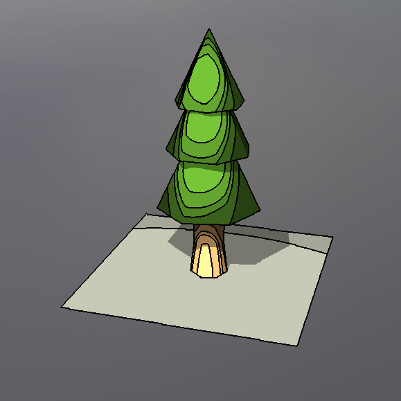

# Project Title

## Progress Summary

1. Summarize what you have accomplished so far.

	<table>
		<thead>
			<tr>
				<th>Feature</th>
				<th>Adapted Points</th>
				<th>Status</th>
			</tr>
		</thead>
		<tbody>
			<tr>
				<td>Mesh and Scene Design</td>
				<td>5</td>
				<td style="background-color: #fff3cd;">Work in progress</td>
			</tr>
			<tr>
				<td>Bloom</td>
				<td>5</td>
				<td style="background-color: #cce5ff;">Upcoming</td>
			</tr>
			<tr>
				<td>Toon Shaders</td>
				<td>10</td>
				<td style="background-color: #d4edda;">Complete (unpolished)</td>
			</tr>
			<tr>
				<tr>
				<td>Deferred Shading</td>
				<td>15</td>
				<td style="background-color: #fff3cd;">Work in progress</td>
				</tr>
			</tr>
			<tr>
				<td>Particle Effects</td>
				<td>15</td>
				<td style="background-color: #d4edda;">Complete (unoptimized)</td>
			</tr>
		</tbody>
	</table>

	<table>
		<caption>Achieved Goals</caption>
		<tr>
			<th></th>
			<th>Leopold Popper</th>
			<th>Ali Gorgani</th>
			<th>Anthony Tamberg</th>
		</tr>
		<tr>
			<td>Week 1 (Proposal)</td>
			<td>Found many resources related to fire simulation.</td>
			<td>Feature Research</td>
			<td>Proposal Write-up</td>
		</tr>
		<tr style="background-color: #f0f0f0;">
			<td>Week 2 (Easter)</td>
			<td>Got familiar with blender.</td>
			<td>Research Deferred and Toon Shading</td>
			<td>-</td>
		</tr>
		<tr>
			<td>Week 3</td>
			<td>-</td>
			<td>-</td>
			<td>-</td>
		</tr>
		<tr>
			<td>Week 4</td>
			<td>More Mesh work and Bloom</td>
			<td>Deferred Shading and Toon</td>
			<td>Billboards and Particles</td>
		</tr>
	</table>

2. Show some preliminary results.

	{width="500px"}

	{width="500px"}
	
	{width="500px"}

	{width="500px"}

	Our project is fairly barebones but its advancing quickly. The particle containers use an evolve method that will be useful for the fire simulation. We'll need to optimize the particle rendering, as well implement deferred shading so that many fire particles (containers) can emit light at a reasonable performance. Toon shaders are practically complete. We've had some difficultly importing the custom meshes and their UVs. We believe we're on track to finish. The idea is that fire will be a particle emitter, light emitter, and actor.
		

3. Optionally present the validation of any feature you have already implemented. This is not mandatory, but can help you get useful feedback for the final report: feature validation will be the main component determining your grade. 

	We haven't validated any of our features yet.

4. Report the number of hours each team member worked on the project.

	<table>
		<caption>Worked Hours</caption>
		<tr>
			<th></th>
			<th>Leopold Popper</th>
			<th>Ali Gorgani</th>
			<th>Anthony Tamberg</th>
		</tr>
		<tr>
			<td>Week 1 (Proposal)</td>
			<td>1</td>
			<td>1</td>
			<td>1</td>
		</tr>
		<tr style="background-color: #f0f0f0;">
			<td>Week 2 (Easter)</td>
			<td>2</td>
			<td>1</td>
			<td>0</td>
		</tr>
		<tr>
			<td>Week 3</td>
			<td>0</td>
			<td>0</td>
			<td>0</td>
		</tr>
		<tr>
			<td>Week 4</td>
			<td>10</td>
			<td>11</td>
			<td>9</td>
		</tr>
	</table>

5. Is the project progressing as expected? Was your workload estimate correct? Critically reflect on your work plan and assess if you are on track.

	It took quite some time getting familiar with blender, and implementing various meshes for our scene. Adding textures to our meshes into the project was harder than expected. The particle system was relatively easy to implement despite initial issues with billboards. Deferred shading seems to be the most difficult challenge currently. Many features require far-reaching changes across the codebase, which has created a couple of rendering bugs. Many of these bugs can be fixed with enough time, but we should focus on implementing all the core features before doing so.

## Schedule Update

1. Acknowledge any delays or unexpected issues, and motivate proposed changes to the schedule, if needed.

	We hadn't realized that Easter break ate into week 3, so we ended up losing that entire week by the time we began working on it on Wednesday. Though, given that we're caught up in the remaining short time, we think we're on track.

2. Present the work plan for the remaining weeks.

	<table>
		<caption>Updated Schedule</caption>
		<tr>
			<th></th>
			<th>Leopold Popper</th>
			<th>Ali Gorgani</th>
			<th>Anthony Tamberg</th>
		</tr>
		<tr>
			<td>Week 5</td>
			<td>Finalize scene and start bloom shaders</td>
			<td>Finalize Toon and start bloom shaders</td>
			<td>Optimize particle system</td>
		</tr>
		<tr>
			<td>Week 6</td>
			<td>Help with deferred shading</td>
			<td>Finish bloom shaders and start deferred shading</td>
			<td>Implement Fire, Firespread</td>
		</tr>
		<tr>
			<td>Week 7</td>
			<td>Video and report</td>
			<td>Finalize deferred shading</td>
			<td>Video and report</td>
		</tr>
	</table>
