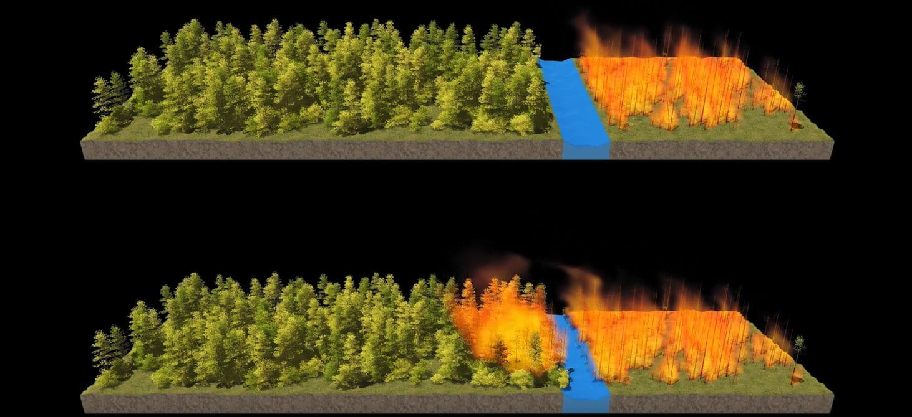
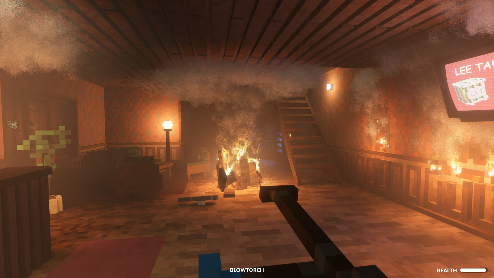
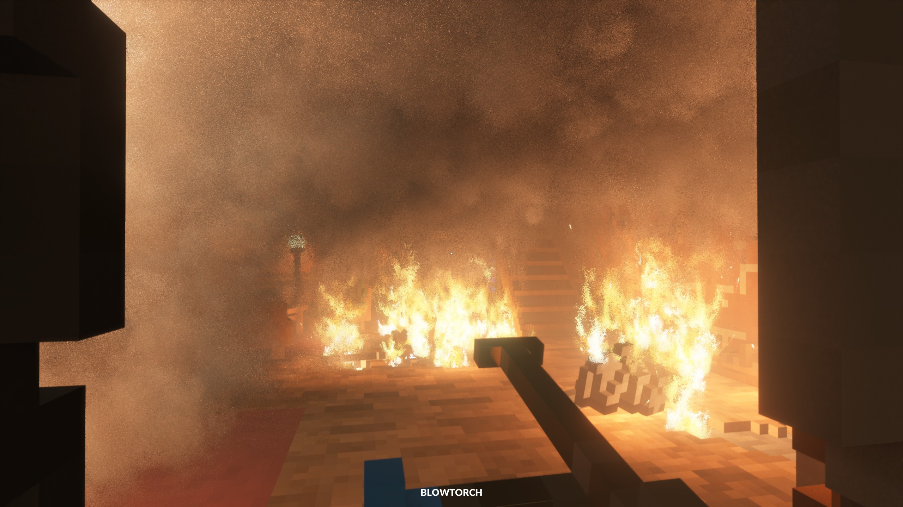

# Fire Simulation

<figure align = "center" style = "width: 600px;">
	
	<figcaption align = "center">
		Figure 1: A virtual forest burning. <i>SIGGRAPH 2021</i>
		
	</figcaption>
</figure>

## Abstract

This project simulates fire in a scene. A player’s click will start (spawn) a fire, and with time will spread throughout the scene. This fire will produce light, smoke particles, and a bloom effect when looking at it. The player will be able to enable toon shaders that will complement the scene's simple polygon esthetic juxtaposed with semi-realistic fire.

We'll need to make a particle system and we anticipate that deferred shading will improve performance in scenes with many light-producing fire nodes. As for technical challenges, we expect the difficulties to appear while implementing fire/smoke spread. Synthesizing the 'hard' features into a complete scene may be difficult. Realistic smoke/fire collisions that one might find in closed spaces may be out of scope for this project. We will primarily use rasterization.

<figure align = "center" style = "width: 600px;">
	
	<figcaption align = "center">
		Figure 2: Fire effect in <i>Teardown</i>. 
		
	</figcaption>
</figure>

Even in graphically simple games, using advanced particle and lighting systems can create a surprisingly 'realistic' visual experience--often more so than high-resolution textures. Our perception of realism is shaped more by how light interacts with the environment than by how detailed individual textures appear. Lighting, shadows, and effects like fog and bloom contribute a lot to the scene’s atmosphere. This principle is a big part of why we chose a fire simulation. Fire effects rely on dynamic lighting, particle behavior, and bloom making it a perfect showcase for how graphical effects can simulate realism without complex models or textures.

## Features

| Feature          							| Points | Adapted Points |
|-------------------------------------------|--------|----------------|
| Mesh and Scene Design	    				| 5      | 5              |
| Bloom										| 5      | 5              |
| Toon Shaders								| 10     | 10             |
| Deferred Shading							| 20     | 15             |
| Particle Effects							| 20     | 15             |

<figure align = "center" style = "width: 600px;">
	
	<figcaption align = "center">
		Figure 3: Fire spread with thick smoke in <i>Teardown</i>. 
		
	</figcaption>
</figure>

## Schedule
(Likely subject to change)

<table>
	<tr>
		<th style="width: 20%"></th>
		<th>Leopold Popper</th>
		<th>Ali Gorgani</th>
		<th>Anthony Tamberg</th>
	</tr>
	<tr>
		<td>Week 1</td>
		<td>Proposal</td>
		<td>Proposal</td>
		<td>Proposal</td>
	</tr>
	<tr style="background-color: #f9f9f9;">
		<td colspan="4" align="center">Proposal</td>
	</tr>
	<tr>
		<td>Week 2 (Easter)</td>
		<td>Work on meshes</td>
		<td>Read up on toon shaders and bloom</td>
		<td>Research fire and smoke particle effects</td>
	</tr>
	<tr>
		<td>Week 3</td>
		<td>Create basic scenes</td>
		<td>Implement toon shaders</td>
		<td>Implement basic phong shading</td>
	</tr>
	<tr>
		<td>Week 4</td>
		<td>Help with deferred shaders or particles</td>
		<td>Begin deferred shaders</td>
		<td>Implement basic particle system</td>
	</tr>
	<tr style="background-color: #f9f9f9;">
		<td colspan="4" align="center">Milestone</td>
	</tr>
	<tr>
		<td>Week 5</td>
		<td>Implement bloom</td>
		<td>Finish deferred shaders</td>
		<td>Finish particle system</td>
	</tr>
	<tr>
		<td>Week 6</td>
		<td>Combine everything</td>
		<td>Create test scenes</td>
		<td>Combine everything</td>
	</tr>
	<tr>
		<td>Week 7</td>
		<td>Video and Report</td>
		<td>Video and Report</td>
		<td>Video and Report</td>
	</tr>
	<tr style="background-color: #f9f9f9;">
		<td colspan="4" align="center">Video and Report</td>
	</tr>
</table>

## Resources

##### Images
- **Figure 1**: [3DVF (2021)](https://3dvf.com/en/siggraph-2021-how-some-researchers-virtually-set-forests-on-fire/) - *Retrieved May 1, 2025.*
- **Figure 2 & 3**: Personal screenshots from *Teardown*

##### Features 
- **Fog:** [3D Game Shaders for Beginners - Fog](https://lettier.github.io/3d-game-shaders-for-beginners/fog.html)
- **Bloom:** [Learn OpenGL Bloom](https://learnopengl.com/Advanced-Lighting/Bloom)
- **Bloom on ShaderToy:** [Bloom](https://www.shadertoy.com/results?query=bloom)
- **Toon Shaders on ShaderToy**: [Toon Shaders](https://www.shadertoy.com/results?query=toon)
- **Blender Meshes:** [Primitives](https://docs.blender.org/manual/en/latest/modeling/meshes/primitives.html)
- **Noise Functions:** [Seph Gentle’s Implementations](https://github.com/josephg/noisejs)
- **Worley Noise:** [The Book of Shaders](https://thebookofshaders.com/12/)
- **Particle Effects:** [Polygon Shredder](https://github.com/spite/polygon-shredder)
- **And other resources listed in the project handout**
